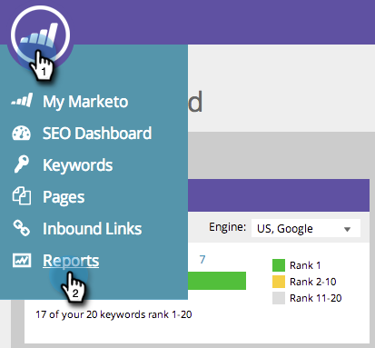
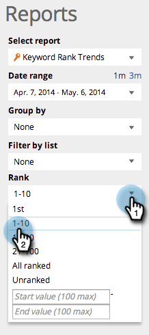
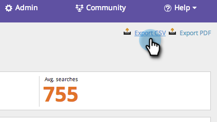

# SEO - 使用关键词趋势报告 {#seo-use-the-keyword-trends-report}

查看您的关键字在一段时间内的排名。

>[!IMPORTANT]
>
>2026年3月31日，Marketo Engage [弃用搜索引擎优化](https://nation.marketo.com/t5/product-blogs/marketo-engage-seo-feature-deprecation/ba-p/359060){target="_blank"}功能。 [seo.marketo.com](https://seo.marketo.com/)在有限的时间内仍然可用。 按照以下文章中的步骤导出任何数据。
>
>* [导出问题](https://experienceleague.adobe.com/zh-hans/docs/marketo/using/product-docs/additional-apps/seo/pages/seo-export-issues-to-csv){target="_blank"}
>* [导出关键字结果](https://experienceleague.adobe.com/zh-hans/docs/marketo/using/product-docs/additional-apps/seo/keywords/seo-exporting-keyword-results){target="_blank"}
>* [导出关键词趋势](https://experienceleague.adobe.com/zh-hans/docs/marketo/using/product-docs/additional-apps/seo/reports/seo-use-the-keyword-trends-report#exporting-data){target="_blank"}
>* [导出竞争者关键词趋势](https://experienceleague.adobe.com/zh-hans/docs/marketo/using/product-docs/additional-apps/seo/reports/seo-use-the-competitor-kw-trends-report#exporting-data){target="_blank"}

## 加载报表 {#load-report}

1. 前往 **[!UICONTROL Reports]**。

   

1. 单击 **[!UICONTROL Keyword Rank Trends]**。

   

   

   **报告项**

   | 项目 | 描述 |
   |---|---|
   | [!UICONTROL Keywords] | 您正在跟踪的关键字数。 |
   | [!UICONTROL Ranking URLs] | 网站排名在您设置的范围中的URL数。 |
   | [!UICONTROL Avg. rank] | 在设置的范围中关键字的平均排名。 |
   | [!UICONTROL Avg. searches] | 在您对Google US搜索设置的范围（过去30天）内对这些关键字发生的平均搜索次数 |

## 筛选数据 {#filtering-data}

1. 单击下拉列表，然后选择所需的时段。

   

1. 单击排名下拉列表以选择要查看关键字的排名范围。

   

## 导出数据 {#exporting-data}

1. 单击 **[!UICONTROL Export CSV]** 或 **[!UICONTROL Export PDF]**。

   
