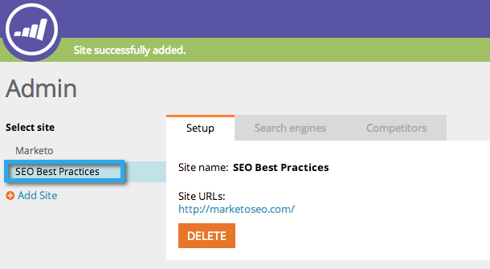

# SEO — 添加站点/删除站点 {#seo-add-a-site-delete-a-site}

为了让Marketo提取与网站页面相关的数据（入站链接和推荐），您必须在此处定义网站的URL。

>[!AVAILABILITY]
>
>并非所有客户都已购买此功能。 有关详细信息，请与您的销售代表联系。

## [!UICONTROL 添加站点] {#add-a-site}

1. 单击“管理员”下拉菜单并选择 **[!UICONTROL 管理员]**.

   >[!NOTE]
   >
   >**需要管理员权限**

   

1. 单击 **[!UICONTROL 添加站点]**.

   

1. 输入 **[!UICONTROL 名称]， [!UICONTROL 网站URL]** 并单击 **[!UICONTROL 保存]**.

   >[!TIP]
   >
   >您还可以添加 **[!UICONTROL 博客URL]** 如果你有的话。

   

   太棒了！ 您刚刚添加了其他站点。

   

## 删除站点 {#delete-a-site}

如果您跟踪多个网站，还可以删除不再需要优化的网站。

1. 单击“管理员”下拉菜单并选择 **[!UICONTROL 管理员]**.

   

1. 单击要删除的站点。

   

1. 单击 **[!UICONTROL 删除]**.

   

1. 确认您要 **[!UICONTROL 删除]**.

   

   >[!NOTE]
   >
   >仅当拥有多个站点时才能删除站点。 如果您只有一个，则可以通过选择站点并单击 **[!UICONTROL 重置]**. 重置站点将 _删除所有网站数据_ 并重新创建站点。
