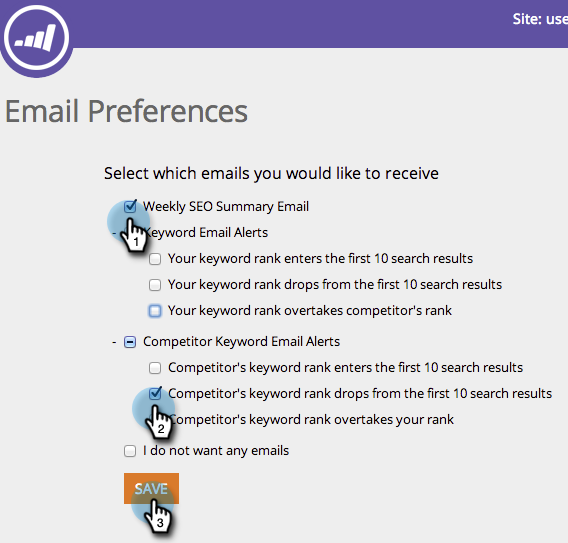

# SEO - 设置电子邮件提醒偏好 {#seo-set-your-email-alert-preferences}

您可以自定义电子邮件首选项，以确定何时会更新您的SEO工作。

>[!IMPORTANT]
>
>2026年3月31日，Marketo Engage将弃用搜索引擎优化功能。 请在3月30日或之前导出任何相关数据。 [了解详情](https://nation.marketo.com/t5/product-blogs/marketo-engage-seo-feature-deprecation/ba-p/359060){target="_blank"}。
>
>* [导出问题](https://experienceleague.adobe.com/zh-hans/docs/marketo/using/product-docs/additional-apps/seo/pages/seo-export-issues-to-csv){target="_blank"}
>* [导出关键字结果](https://experienceleague.adobe.com/zh-hans/docs/marketo/using/product-docs/additional-apps/seo/keywords/seo-exporting-keyword-results){target="_blank"}
>* [导出关键词趋势](https://experienceleague.adobe.com/zh-hans/docs/marketo/using/product-docs/additional-apps/seo/reports/seo-use-the-keyword-trends-report#exporting-data){target="_blank"}
>* [导出竞争者关键词趋势](https://experienceleague.adobe.com/zh-hans/docs/marketo/using/product-docs/additional-apps/seo/reports/seo-use-the-competitor-kw-trends-report#exporting-data){target="_blank"}

1. 在顶部导航栏中，单击您的用户名。 单击 **[!UICONTROL Email Preferences]**。

   

1. 指示您希望通过电子邮件收到哪些提醒，然后单击&#x200B;**[!UICONTROL Save]**。

   
