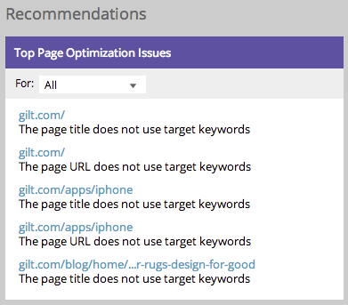

# 了解SEO仪表板:SEO Recommendations {#understanding-the-seo-dashboard-seo-recommendations}

使用该仪表板，可以更深入地视图关键词排名的趋势，以及您的网站针对SEO的优化程度。

您还可以了解如何改进使用Recommendations部分。 让我们跳进去！

## 热门页面优化问题{#top-page-optimization-issues}

这将向您展示五种极具影响力的开始方法，以立即优化您的站点！ 只需单击任意链接，即可视图完整的[页面详细信息向下钻取](/help/marketo/product-docs/additional-apps/seo/pages/seo-using-the-page-detail-drill-down.md)。

>[!TIP]
>
>您可以单击“最热门的页面优化问题”来查看完整列表。

## 热门链接机会{#top-link-opportunities}

让知名网站链接到您的内容可以提高页面排名。 以下是我们为您网站找到的一些最优先的机会。

>[!TIP]
>
>您可以单击“顶级链接优化”来查看完整列表。

快！ 深入此处。

>[!MORELIKETHIS]
>
>[页面详细信息向下钻取](../../../../product-docs/additional-apps/seo/pages/seo-using-the-page-detail-drill-down.md)
