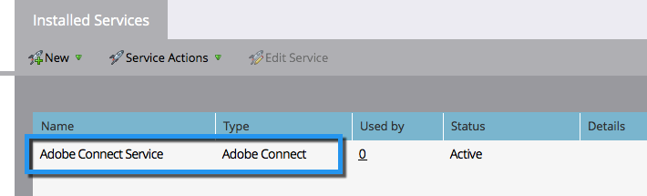

# 将Adobe Connect添加为 [!DNL LaunchPoint] 服务 {#add-adobe-connect-as-a-launchpoint-service}

Marketo管理您的Adobe Connect网络研讨会注册和出席情况。

>[!NOTE]
>
>**需要管理员权限**

>[!NOTE]
>
>此步骤需要现有的Adobe Connect订阅和管理权限。 准备好以下设置：用户名、密码、参与者密码和会议文件夹URL。

>[!NOTE]
>
>当前不支持Adobe Connect On Site。

1. 转到 **[!UICONTROL 管理员]** 区域。

   

1. 单击 **[!UICONTROL 启动点]**.

   

1. 单击 **[!UICONTROL 新]** 下拉菜单并选择 **[!UICONTROL 新服务]**.

   

1. 输入 **[!UICONTROL 显示名称]**. 下 **[!UICONTROL 服务]**，选择Adobe Connect。

   

1. 输入您的 **[!UICONTROL 用户名]** 和 **[!UICONTROL 访问代码]**.

   

1. 输入您的 **[!UICONTROL 会议文件夹URL]** 和 **[!UICONTROL 参与者密码]**，然后单击 **[!UICONTROL 创建]**.

   

   >[!TIP]
   >
   >创建参与者密码时，您选择的值将在发送事件的链接时包含在查询字符串中。 因此，我们建议您使其对客户友好。

   >[!NOTE]
   >
   >登录Adobe Connect帐户后，选择 **[!UICONTROL 研讨会]** 选项卡。 无需深入了解任何特定研讨会，只需将URL从浏览器栏复制到 **[!UICONTROL 会议文件夹URL]** 设置。

您的Adobe Connect服务现已与Marketo同步！

>[!MORELIKETHIS]
>
>了解如何 [使用Adobe Connect创建事件](/help/marketo/product-docs/demand-generation/events/create-an-event/create-an-event-with-adobe-connect.md){target="_blank"}.
