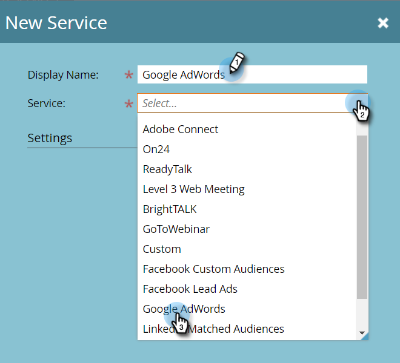
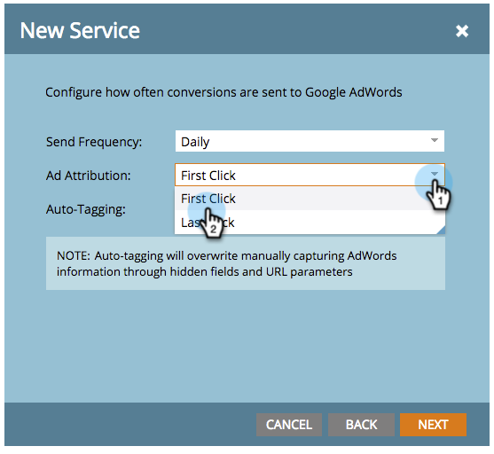

# 使用经理帐户添加[!DNL Google AdWords]作为[!DNL Launchpoint]服务 {#add-google-adwords-as-a-launchpoint-service-with-a-manager-account}

将您的[!DNL Google AdWords]帐户关联到Marketo以自动将离线转化数据从Marketo上传到[!DNL Google AdWords]。 然后，在[!DNL AdWords]中[添加自定义列](https://support.google.com/adwords/answer/3073556){target="_blank"}后，您可以从[!DNL AdWords] UI中查看哪些点击导致合格的潜在客户、机会和新客户（或您希望跟踪的任何收入阶段）。 此信息不显示在Marketo UI中。

如果您有多个[!DNL Google Adwords]帐户，则可以使用[[!DNL Google AdWords Manager Account]](https://www.google.com/adwords/manager-accounts/){target="_blank"}（以前称为[!DNL My Client Center]）将它们与Marketo集成。

详细了解[Google的脱机转换导入功能](https://support.google.com/adwords/answer/2998031?hl=en){target="_blank"}。

>[!AVAILABILITY]
>
>并非所有Marketo Engage用户都已购买此功能。 有关详细信息，请联系Adobe客户团队（您的客户经理）。

>[!NOTE]
>
>**需要管理员权限**

>[!NOTE]
>
>您还可以将[独立 [!DNL Google AdWords] 帐户集成为 [!DNL Launchpoint] 服务](/help/marketo/product-docs/administration/additional-integrations/add-google-adwords-as-a-launchpoint-service.md){target="_blank"}。

1. 进入 **[!UICONTROL Admin]** 区域。

   

1. 选择 **[!UICONTROL LaunchPoint]**。

   

1. 点击 **[!UICONTROL New]** 下拉菜单，并选择 **[!UICONTROL New Service]**。

   

1. 输入&#x200B;**[!UICONTROL Display Name]**&#x200B;并选择&#x200B;**[!UICONTROL Google AdWords]**。

   

1. 选择 **[!UICONTROL Authorize Marketo]**。

   >[!NOTE]
   >
   >确保注销个人[!DNL Gmail]帐户并启用弹出窗口。

   

1. 选择与&#x200B;**[!DNL Google AdWords]**&#x200B;关联的帐户。

   

1. 单击 **[!UICONTROL Accept]**。

   

1. 状态为&#x200B;**[!UICONTROL Success]**。 选择 **[!UICONTROL Next]**。

   

1. 将离线转化从Marketo上载到[!DNL Google AdWords] **[!UICONTROL Weekly]**&#x200B;或&#x200B;**[!UICONTROL Daily]**。

   

1. 属性转换为&#x200B;**[!UICONTROL First Click]**&#x200B;或&#x200B;**[!UICONTROL Last Click]**。

   

   | 类型 | 定义 |
   |---|---|
   | [!UICONTROL First Click] | 离线转化将归因于某人在过去90天内点击的第一个[!DNL AdWords]广告 |
   | [!UICONTROL Last Click] | 离线转化将归因于某人点击的最后一个[!DNL AdWords]广告 |

   >[!NOTE]
   >
   >必须选择[自动标记](https://support.google.com/adwords/answer/1752125?hl=en){target="_blank"}才能使此功能正常工作。 必须在[!DNL AdWords]内激活它。

1. 单击 **[!UICONTROL Next]**。

   

1. 取消选择不想更新的帐户。 单击 **[!UICONTROL Create]**。

   

   请参阅下面的相关文章，了解如何在收入模型中映射[!DNL AdWords]离线转化。

   >[!MORELIKETHIS]
   >
   >使用经理帐户在收入模型中[设置 [!DNL Google AdWords] 转化](/help/marketo/product-docs/reporting/revenue-cycle-analytics/revenue-cycle-models/set-google-adwords-conversions-in-the-revenue-model-with-a-manager-account.md){target="_blank"}
