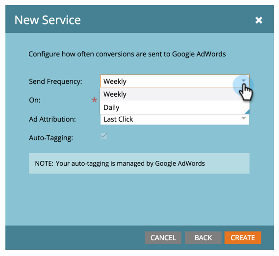

# 将Google AdWords添加为LaunchPoint服务 {#add-google-adwords-as-a-launchpoint-service}

将您的Google AdWords帐户关联到Marketo，以自动将离线转化数据从Marketo上传到Google AdWords。 然后，从AdWords UI中，您将能够轻松地查看哪些点击在您之后产生了合格的潜在客户、商机和新客户（或您想要跟踪的任何收入阶段） [添加自定义列](https://support.google.com/adwords/answer/3073556) 在AdWords中。 此信息未显示在Marketo UI中。

详细了解 [Google离线转化导入功能](https://support.google.com/adwords/answer/2998031?hl=en).

>[!AVAILABILITY]
>
>并非所有客户都购买了此功能。 有关详细信息，请联系您的客户成功经理。

>[!NOTE]
>
>**需要管理员权限**

>[!NOTE]
>
>您还可以将 [Google AdWords as a Launchpoint服务（具有经理帐户）](/help/marketo/product-docs/administration/additional-integrations/add-google-adwords-as-a-launchpoint-service-with-a-manager-account.md).

1. 转到 **管理员** 中。

   

1. 选择 **LaunchPoint**.

   

1. 选择 **新建** 和 **新服务**.

   

1. 输入显示名称并选择 **Google AdWords**.

   

1. 选择 **授权Marketo**.

   >[!NOTE]
   >
   >确保注销您的个人Gmail帐户并启用弹出窗口。

   

1. 选择与Google AdWords关联的帐户。

   

1. 选择 **接受**.

   

1. 状态将显示为 **成功**. 选择 **下一个**.

   

1. 将离线转化从Marketo上传到Google AdWords **每周** 或 **每日**.

   

1. 属性转换到 **首次单击** 或 **上次点击**.

   | 类型 | 定义 |
   |---|---|
   | 首次单击 | 离线转化将归因于用户在过去90天内点击的第一个AdWords广告 |
   | 上次点击 | 离线转化将归因于人员点击的最后一个AdWords广告 |

   >[!NOTE]
   >
   >在Marketo和AdWords中使用一致的归因模型可提供最准确的数据。

   

1. 单击 **创建**.

   

   >[!NOTE]
   >
   >[自动标记](https://support.google.com/adwords/answer/1752125?hl=en) 必须选择此功能才能正常工作。 必须在AdWords内完成停用。

太棒了！ 现在，请参阅下面的相关文章，了解如何在收入模型中映射AdWords离线转化。

>[!MORELIKETHIS]
>
>[在收入模型中设置Google AdWords转化](/help/marketo/product-docs/reporting/revenue-cycle-analytics/revenue-cycle-models/set-google-adwords-conversions-in-the-revenue-model.md)
