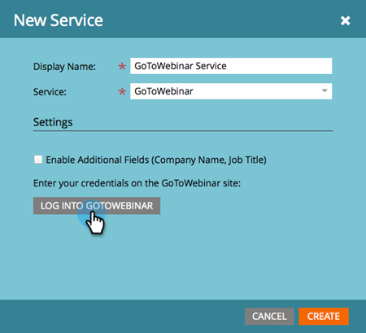

# 添加 [!DNL GoToWebinar] as a [!DNL LaunchPoint] 服务 {#add-gotowebinar-as-a-launchpoint-service}

Marketo管理您的 [!DNL GoToWebinar] 注册及出席情况。

>[!NOTE]
>
>**需要管理员权限**

>[!NOTE]
>
>现有订阅 [!DNL GoToWebinar] 和管理权限对于此步骤是必需的。 拥有用于登录的电子邮件和密码 [!DNL GoToWebinar] 手边。

>[!NOTE]
>
>[!DNL GoToMeeting]， [!DNL GoToWebcast]、和 [!DNL GoToTraining] 当前不支持。

1. 转到 **[!UICONTROL 管理员]** 区域。

   

1. 单击 **[!UICONTROL 启动点]**.

   

1. 选择 **[!UICONTROL 新]** 和 **[!UICONTROL 新服务]**.

   

1. 输入 **[!UICONTROL 显示名称]**. 下 **[!UICONTROL 服务]**，选择 **[!UICONTROL GoTo网络研讨会]**.

   

1. 单击 **[!UICONTROL 登录GoTo网络研讨会]**.

   

   >[!NOTE]
   >
   >如果要将Marketo表单中的公司名称和职称同步到 [!DNL GoToWebinar]，选择 **[!UICONTROL 启用其他字段]** 盒子。

1. 在 [!DNL GoToWebinar] 登录弹出窗口，输入您的 **[!UICONTROL GoTo网络研讨会]** 电子邮件和密码，然后单击 **[!UICONTROL 登录]**.

   

1. 关闭窗口后，单击 **[!UICONTROL 创建]**.

   

1. 太棒了！ 您的 **[!UICONTROL GoTo网络研讨会]** 帐户现已与Marketo同步。

   

>[!CAUTION]
>
>当您在中更新密码时 [!DNL GoToWebinar]，您还必须在Marketo中更新密码。

>[!MORELIKETHIS]
>
>了解如何 [创建事件，使用 [!DNL GotoWebinar]](/help/marketo/product-docs/demand-generation/events/create-an-event/create-an-event-with-gotowebinar.md){target="_blank"}.
