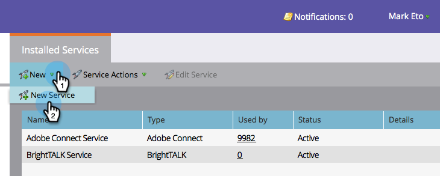

# 将GoToWebinar添加为LaunchPoint服务{#add-gotowebinar-as-a-launchpoint-service}

Marketo管理您的GoTo网络研讨会注册和出席情况。

>[!NOTE]
>
>**需要管理权限**

>[!NOTE]
>
>此步骤需要现有的“转到网络研讨会”和管理权限订阅。 手边有用于登录GoToWebinar的电子邮件和密码。

>[!NOTE]
>
>目前不支持GoToMeeting、GoToWebcast和GoToTraining。

1. 转至&#x200B;**Admin**&#x200B;并选择&#x200B;**LaunchPoint**。

   

1. 选择&#x200B;**新建**&#x200B;和&#x200B;**新建服务**。

   

1. 输入&#x200B;**显示名称**。 在&#x200B;**服务**&#x200B;下，选择&#x200B;**GoToWebinar**。

   

1. 然后，单击&#x200B;**登录GoToWebinar**。

   

   >[!NOTE]
   >
   >如果要将Marketo表单中的公司名称和作业标题同步到GoToWebinar，请选择&#x200B;**启用其他字段**&#x200B;框。

1. 在“GoToWebinar登录”弹出窗口中，输入您的&#x200B;**GoToWebinar**&#x200B;电子邮件和密码，然后单击&#x200B;**登录**。

   

1. 窗口关闭后，单击&#x200B;**创建**。

   

1. 太棒了！ 您的&#x200B;**GoToWebinar**&#x200B;帐户现已与Marketo同步。

   

>[!CAUTION]
>
>在GoToWebinar中更新密码时，您还必须在Marketo中更新密码。

>[!MORELIKETHIS]
>
>了解如何使用GotoWebinar](/help/marketo/product-docs/demand-generation/events/create-an-event/create-an-event-with-gotowebinar.md)创建事件。[
