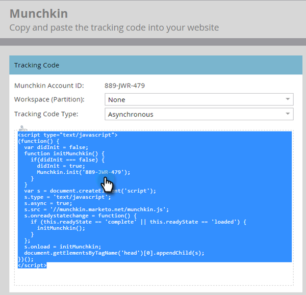

# 将Munchkin跟踪代码添加到您的网站 {#add-munchkin-tracking-code-to-your-website}

Marketo的自定义JavaScript跟踪代码（称为Munchkin）可跟踪访问您网站的所有个人，以便您能够通过自动营销活动对其访问做出响应。 甚至会跟踪匿名访客及其IP地址和其他信息。 **如果没有此跟踪代码，您将无法跟踪您网站上的访问或其他活动**!

>[!PREREQUISITES]
>
>请确保您有权访问经验丰富的JavaScript开发人员。 Marketo技术支持未设置为协助对自定义JavaScript进行故障诊断。

## 将跟踪代码添加到您的网站 {#add-tracking-code-to-your-website}

>[!NOTE]
>
>Adobe Experience Cloud客户还可以在Launch中使用Marketo的集成，在其网页上包含Munchkin脚本。 获取应用程序 [此处](https://www.adobeexchange.com/experiencecloud.details.101054.html).

1. 转到 **管理员** 的上界。

   

1. 单击 **蒙奇金**.

   

1. 为跟踪代码类型选择异步。

   

   >[!NOTE]
   >
   >在几乎所有情况下，您都应使用异步代码。 [了解详情](#types-of-munchkin-tracking-codes).

1. 单击并复制Javascript跟踪代码以放置到您的网站上。

   

   >[!CAUTION]
   >
   >请勿使用此屏幕截图中显示的代码 — 您必须使用帐户中显示的唯一代码！

   >[!TIP]
   >
   >将跟踪代码置于要跟踪的网页上。 这可以是较小网站的每个页面，或者只能是具有许多动态生成网页、用户论坛等的网站上的关键页面。

   为获得最佳结果，请使用异步Munchkin代码，并将其放置在 `<head>` 页面的元素。 如果您使用的是简单代码（不推荐），则位于 `</body>` 标记。

   

   >[!TIP]
   >
   >对于流量较大（即每月访问数十万次）的网站，我们建议您选择不跟踪匿名用户。 [了解详情](https://developers.marketo.com/documentation/websites/lead-tracking-munchkin-js/).

## 使用多个工作区时添加跟踪代码 {#add-tracking-code-when-using-multiple-workspaces}

如果您在Marketo帐户中使用工作区，则可能还具有与工作区对应的单独Web存在。 在这种情况下，您可以使用Munchkin跟踪Javascript将匿名人员分配到正确的工作区和分区。

1. 转到 **管理员** 的上界。

   

1. 单击 **蒙奇金**.

   

1. 为要跟踪的网页选择相应的工作区。

   

   >[!NOTE]
   >
   >如果您不使用特殊工作区Munchkin代码，则会将人员分配到设置帐户时创建的默认分区。 它最初名为“默认”，但您可能已在自己的Marketo帐户中更改了该设置。

1. 选择 **异步** ，用于跟踪代码类型。

   

1. 单击并复制JavaScript跟踪代码以放置到您的网站上。

   

   >[!CAUTION]
   >
   >请勿使用此屏幕截图中显示的代码 — 您必须使用帐户中显示的唯一代码！

1. 将跟踪代码放置在 `<head>` 元素。 访问此页面的新人员将被分配到此分区。

   

   >[!CAUTION]
   >
   >对于页面上的单个分区和工作区，只能使用一个Munchkin跟踪脚本。 请勿在您的网站上包含多个分区/工作区的跟踪脚本。

   >[!NOTE]
   >
   >在Marketo中创建的登陆页面会自动包含跟踪代码，因此您无需将此代码放置到其中。

## Munchkin跟踪代码的类型 {#types-of-munchkin-tracking-codes}

您可以选择三种类型的Munchkin跟踪代码。 每种方法对网页加载次数的影响各不相同。

1. **简单**:具有最少的代码行，但不会优化网页加载时间。 每次加载网页时，此代码都会加载jQuery库。
1. **异步**:缩短网页加载时间。
1. **异步jQuery**:减少网页加载时间，提高系统性能。 此代码假定您已拥有jQuery，且不检查是否加载它。

## 测试Munchkin代码是否可用 {#test-if-your-munchkin-code-is-working}

要检查在添加Munchkin代码后代码是否正常工作，请执行以下操作：

1. 访问您的网页。

1. 在您的Marketo中，单击 **Analytics** 拼贴。

   

1. 单击 **网页活动**.

   

1. 单击 **设置** ，双击 **活动源**.

   

1. 将活动源更改为 **匿名访客（包括ISP）** 单击 **应用**.

   

1. 单击 **报表** 选项卡。

   

   >[!NOTE]
   >
   >如果看不到任何数据，请等待几分钟，然后单击底部的刷新图标。
