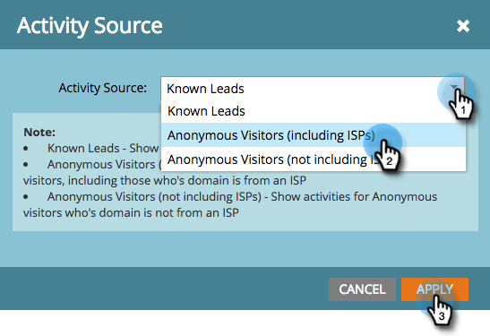

# 将[!DNL Munchkin]跟踪代码添加到您的网站 {#add-munchkin-tracking-code-to-your-website}

Marketo的自定义JavaScript跟踪代码（称为[!DNL Munchkin]）可跟踪访问您网站的所有个人，以便您能够通过自动营销活动对其访问做出反应。 甚至匿名访客也会与其IP地址和其他信息一起被跟踪。 **如果没有此跟踪代码，您将无法跟踪您网站上的访问次数或其他活动**！

>[!PREREQUISITES]
>
>请确保您有权访问经验丰富的JavaScript开发人员。 Marketo技术支持未设置为协助对自定义JavaScript进行故障诊断。

## 将跟踪代码添加到您的网站 {#add-tracking-code-to-your-website}

>[!NOTE]
>
>Adobe Experience Cloud用户还可以使用Adobe启动项[&#128279;](https://exchange.adobe.com/apps/ec/100223/adobe-launch-core-extension){target="_blank"}中的Marketo集成以在其网页上包含[!DNL Munchkin]脚本。 如果您使用Adobe启动项，_将自动添加[!DNL Munchkin]脚本_，因此您无需自行添加。

1. 转到&#x200B;**[!UICONTROL 管理员]**&#x200B;区域。

   

1. 单击&#x200B;**[!UICONTROL Munchkin]**。

   

1. 为&#x200B;**[!UICONTROL 跟踪代码类型]**&#x200B;选择&#x200B;**[!UICONTROL 异步]**。

   

   >[!NOTE]
   >
   >在大多数情况下，您应使用异步代码。 [了解详情](#types-of-munchkin-tracking-codes)。

1. 单击并复制Javascript跟踪代码以放置到您的网站上。

   

   >[!CAUTION]
   >
   >请勿使用此屏幕快照中显示的代码 — 您必须使用帐户中显示的唯一代码！

   >[!TIP]
   >
   >将跟踪代码置于要跟踪的网页上。 这可能是较小站点的每个页面，或者只有具有许多动态生成的网页、用户论坛等的站点上的关键页面。

   为获得最佳结果，请使用异步[!DNL Munchkin]代码并将其置于页面的`<head>`元素中。 如果您使用的是简单代码（不推荐），则它位于`</body>`标记之前。

   

   >[!TIP]
   >
   >对于访问量大的网站（即每月访问数十万次），我们建议您选择不跟踪匿名人员。 [了解详情](https://experienceleague.adobe.com/en/docs/marketo-developer/marketo/javascriptapi/lead-tracking/){target="_blank"}。

## 使用多个工作区时添加跟踪代码 {#add-tracking-code-when-using-multiple-workspaces}

如果您在Marketo帐户中使用工作区，则可能还会有与您的工作区对应的单独Web存在。 在这种情况下，您可以使用[!DNL Munchkin]跟踪Javascript将匿名用户分配到正确的工作区和分区。

1. 转到&#x200B;**[!UICONTROL 管理员]**&#x200B;区域。

   

1. 单击&#x200B;**[!UICONTROL Munchkin]**。

   

1. 为要跟踪的网页选择适当的工作区。

   

   >[!NOTE]
   >
   >如果不使用特殊工作区[!DNL Munchkin]代码，则将向帐户设置时创建的默认分区分配用户。 它最初名为“[!UICONTROL 默认值]”，但您可能在自己的Marketo帐户中更改了此名称。

1. 为&#x200B;**[!UICONTROL 跟踪代码类型]**&#x200B;选择&#x200B;**[!UICONTROL 异步]**。

   

1. 单击并复制JavaScript跟踪代码以放置到您的网站上。

   

   >[!CAUTION]
   >
   >请勿使用此屏幕快照中显示的代码 — 您必须使用帐户中显示的唯一代码！

1. 将跟踪代码放在网页的`<head>`元素中。 访问此页面的新用户将分配给此分区。

   

   >[!CAUTION]
   >
   >您只能对页面上的单个分区和工作区使用一个[!DNL Munchkin]跟踪脚本。 不要在网站上包含多个分区/工作区的跟踪脚本。

   >[!NOTE]
   >
   >在Marketo中创建的登陆页面会自动包含跟踪代码，因此您无需在其上放置此代码。

## [!DNL Munchkin]跟踪代码的类型 {#types-of-munchkin-tracking-codes}

有三种类型的[!DNL Munchkin]跟踪代码可供选择。 每种方法都会以不同的方式影响网页加载时间。

1. **[!UICONTROL Simple]**：代码行数最少，但无法优化网页加载时间。 每次加载网页时，此代码都会加载jQuery库。
1. **[!UICONTROL 异步]**：缩短网页加载时间。
1. **[!UICONTROL 异步jQuery]**：减少了网页加载时间，也提高了系统性能。 此代码假定您已经拥有jQuery，并且不检查以加载它。

## 测试您的[!DNL Munchkin]代码是否正常工作 {#test-if-your-munchkin-code-is-working}

要在添加[!DNL Munchkin]代码后检查该代码是否正常工作，请执行以下操作：

1. 访问网页。

1. 在您的[!DNL My Marketo]中，单击&#x200B;**[!UICONTROL Analytics]**&#x200B;磁贴。

   

1. 单击&#x200B;**[!UICONTROL 网页活动]**。

   

1. 单击&#x200B;**[!UICONTROL 设置]**&#x200B;选项卡，双击&#x200B;**[!UICONTROL 活动Source]**。

   

1. 将[!UICONTROL 活动Source]更改为&#x200B;**[!UICONTROL 匿名访客（包括ISP）]**，然后单击&#x200B;**[!UICONTROL 应用]**。

   

1. 单击&#x200B;**[!UICONTROL 报表]**&#x200B;选项卡。

   

   >[!NOTE]
   >
   >如果您没有看到任何数据，请等待几分钟，然后单击底部的刷新图标。
