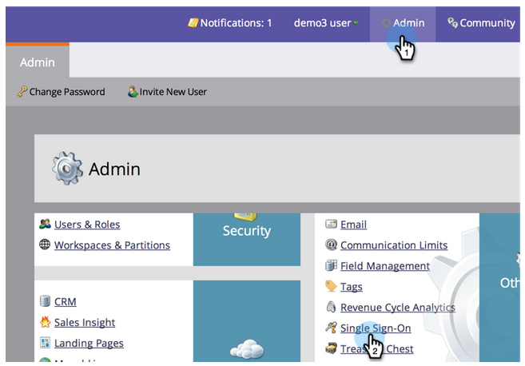

# 将单一登录添加到门户{#add-single-sign-on-to-a-portal}

如果您有对用户进行身份验证的目录服务，则可以允许将单点登录(SSO)导入Marketo。 我们使用安全断言标记语言(SAML)版本2.0及更高版本支持此功能。

Marketo用作SAML服务提供商(SP)，并依赖外部标识提供者(IdP)来验证用户身份。

启用SSO后，IdP可验证用户凭据。 当用户希望使用Marketo软件时，IdP随后会向Marketo发送一条签名的SAML消息，充当SP。 此邮件向Marketo保存用户有权使用Marketo软件的保险箱。

>[!NOTE]
>
>**需要管理权限**

>[!NOTE]
>
>您是Microsoft Azure用户吗？ 查看他们的[集成教程](https://azure.microsoft.com/en-us/documentation/articles/active-directory-saas-marketo-tutorial/)。

## 如何发送请求{#how-to-send-the-request}

* 将SSO请求（即SAML响应）发送到`https://login.marketo.com/saml/assertion/<your-munchkin-id>`
* 作为SP的受众URL。 使用`https://saml.marketo.com/sp`
* 如果使用SPNameQualifier属性，请将“主题”的NameID元素设置为`https://saml.marketo.com/sp`
* 如果要将多个Marketo订阅联合到同一SSO提供程序，则可以对格式为`https://saml.marketo.com/sp/<munchkin_id>`的每个Marketo子使用唯一的SP URL

>[!NOTE]
>
>Marketo仅支持由标识提供者启动（也称为IdP启动），用户在此启动中首先启动Idp登录页面，进行身份验证，然后导航到我的Marketo。

## 附加注释{#additional-notes}

* **同步时间**  — 对于新用户，在处理初始SSO请求前大约有10分钟的延迟。
* **用户设置**  — 用户由Marketo手动设置。
* **授权**  — 在Marketo中保留用户权限。
* **OAuth支持** - Marketo当前不支持OAuth。
* **自动用户传播**  — 也称为“即时设置”，此时用户的首次SAML登录能够在用户访问的任何Web应用程序(例如Marketo)中创建用户，并且不需要手动管理操作。Marketo目前不支持此功能。
* **Encryption**  - Marketo当前不支持加密。

>[!NOTE]
>
>在开始之前，请将您的Identity Provider证书设置为X.509格式，并以.crt、.der或.cer扩展名提供。

## 更新SAML设置{#update-saml-settings}

默认情况下，SSO处于禁用状态。 请按照以下步骤启用并配置SAML。

1. 转至&#x200B;**Admin**&#x200B;并单击&#x200B;**单点登录**。

   

   >[!NOTE]
   >
   >如果您在&#x200B;**Admin**&#x200B;下未看到&#x200B;**单点登录**，请与[Marketo支持](https://nation.marketo.com/t5/Support/ct-p/Support)联系。

1. 在&#x200B;**SAML设置**&#x200B;部分下，单击&#x200B;**编辑**。

   

1. 将&#x200B;**SAML Single Sign-On**&#x200B;更改为&#x200B;**Enabled**。

   

1. 输入&#x200B;**颁发者ID**、**实体ID**，选择&#x200B;**用户ID位置**，然后单击&#x200B;**浏览**。

   

1. 选择&#x200B;**标识提供者证书**&#x200B;文件。

   

1. 单击&#x200B;**保存**。

   

## 更新重定向页面设置{#update-redirect-page-settings}

1. 在&#x200B;**重定向页面**&#x200B;部分下，单击&#x200B;**编辑**。

   

   >[!NOTE]
   >
   >使用通用ID和SSO的客户必须在&#x200B;**登录URL**&#x200B;字段中输入标识提供者的登录URL。

1. 输入&#x200B;**注销URL**。 这是您希望用户在注销Marketo时被定向到的URL。

   

1. 输入&#x200B;**错误URL**。 这是您希望用户在登录Marketo失败时被定向到的URL。 单击&#x200B;**保存**。

   

   >[!NOTE]
   >
   >这两个页面必须公开。

>[!MORELIKETHIS]
>
>* [使用通用ID进行订阅登录](/help/marketo/product-docs/administration/settings/using-a-universal-id-for-subscription-login.md)
>* [限制用户仅登录SSO](/help/marketo/product-docs/administration/additional-integrations/restrict-user-login-to-sso-only.md)
>* [邀请Marketo用户加入两个具有通用ID的实例](https://nation.marketo.com/t5/Knowledgebase/Inviting-Marketo-Users-to-Two-Instances-with-Universal-ID-UID/ta-p/251122)

