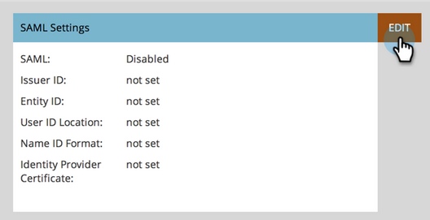
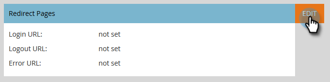

# 将单点登录添加到门户 {#add-single-sign-on-to-a-portal}

如果您拥有对用户进行身份验证的目录服务，则可以允许单点登录(SSO)进入Marketo。 我们使用以下方式支持此功能 [!DNL Security Assertion Markup Language] (SAML)版本2.0及更高版本。

Marketo充当SAML服务提供商(SP)，依靠外部身份提供程序(IdP)对用户进行身份验证。

启用SSO后，IdP可以验证用户的凭据。 当用户希望使用Marketo软件时，IdP随后会向Marketo发送一条签名的SAML消息，充当SP。 此消息向Marketo保证用户有权使用Marketo软件。

>[!NOTE]
>
>**需要管理员权限**

>[!NOTE]
>
>您是 [!DNL Microsoft Azure] 用户？ 查看他们的 [集成教程](https://azure.microsoft.com/en-us/documentation/articles/active-directory-saas-marketo-tutorial/){target="_blank"}.

## 如何发送请求 {#how-to-send-the-request}

* 将SSO请求（一个SAML响应）发送到 `https://login.marketo.com/saml/assertion/<your-munchkin-id>`
* 作为SP的受众URL。 使用 `http://saml.marketo.com/sp`
* 如果使用SPNameQualifier属性，请将Subject的NameID元素设置为 `http://saml.marketo.com/sp`
* 如果您要将多个Marketo订阅联合到同一个SSO提供商，则可以使用格式为每个Marketo子使用唯一的SP URL `http://saml.marketo.com/sp/<munchkin_id>`

>[!NOTE]
>
>Marketo仅支持身份提供程序启动的（也称为IdP启动的），用户在该操作中首先启动Idp登录页面，进行身份验证，然后导航到“我的Marketo”。

## 其他说明 {#additional-notes}

* **同步时间**  — 对于新用户，在处理初始SSO请求之前，大约会延迟10分钟。
* **用户设置** - Marketo手动配置用户。
* **授权**  — 在Marketo中维护用户权限。
* **OAuth支持** - Marketo当前不支持OAuth。
* **自动用户传播**  — 也称为“准时配置”，这是指用户首次通过SAML登录时，能够在用户访问的任何网络应用程序(例如Marketo)中创建用户，并且无需手动管理操作的情况。 Marketo目前不支持此功能。
* **加密** - Marketo当前不支持加密。

>[!NOTE]
>
>在开始之前，请将X.509格式的身份提供程序证书扩展名为.crt、.der或.cer。

## 更新SAML设置 {#update-saml-settings}

默认情况下，SSO处于禁用状态。 按照以下步骤启用SAML并对其进行配置。

1. 转到 **[!UICONTROL 管理员]** 区域。

   

1. 单击 **[!UICONTROL 单点登录]**.

   

   >[!NOTE]
   >
   >如果您没有看到 **[!UICONTROL 单点登录]** 下 **[!UICONTROL 管理员]**，联系人 [Marketo支持](https://nation.marketo.com/t5/Support/ct-p/Support){target="_blank"}.

1. 在 **[!UICONTROL SAML设置]** 部分，单击 **[!UICONTROL 编辑]**.

   

1. 更改 **[!UICONTROL SAML单点登录]** 到 **[!UICONTROL 已启用]**.

   

1. 输入您的 **[!UICONTROL 颁发者ID]**， **[!UICONTROL 实体Id]**，选择 **[!UICONTROL 用户ID位置]**，然后单击 **[!UICONTROL 浏览]**.

   

1. 选择您的 **[!UICONTROL 身份提供程序证书]** 文件。

   

1. 单击 **[!UICONTROL 保存]**.

   

## 更新重定向页面设置 {#update-redirect-page-settings}

1. 在 **[!UICONTROL 重定向页面]** 部分，单击 **[!UICONTROL 编辑]**.

   

   >[!NOTE]
   >
   >使用通用ID和SSO的客户必须在以下位置输入身份提供程序的登录URL： **[!UICONTROL 登录URL]** 字段。

1. 输入 **[!UICONTROL 注销URL]**. 这是您希望用户注销Marketo时定向到的URL。

   

1. 输入 **[!UICONTROL 错误URL]**. 这是您希望用户定向到的URL，以防登录Marketo失败。 单击 **[!UICONTROL 保存]**.

   

   >[!NOTE]
   >
   >这两个页面都必须可公开使用。

>[!MORELIKETHIS]
>
>* [使用通用ID进行订阅登录](/help/marketo/product-docs/administration/settings/using-a-universal-id-for-subscription-login.md){target="_blank"}
>* [仅限用户登录SSO](/help/marketo/product-docs/administration/additional-integrations/restrict-user-login-to-sso-only.md){target="_blank"}
>* [使用通用ID将Marketo用户邀请到两个实例](https://nation.marketo.com/t5/Knowledgebase/Inviting-Marketo-Users-to-Two-Instances-with-Universal-ID-UID/ta-p/251122){target="_blank"}

