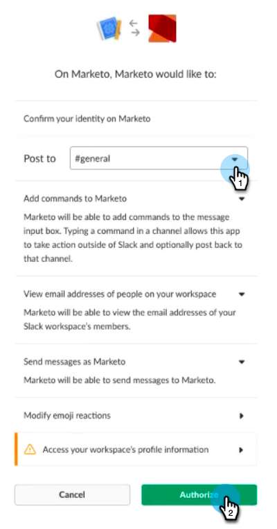

# 将Slack添加为LaunchPoint服务 {#add-slack-as-a-launchpoint-service}

Slack集成包含两种通知类型：

* **系统通知**:获取有关Marketo实例中重要事件的Slack通知，如有关当前活动状态和任何需要立即注意的问题（CRM错误和API限制）的警报。
* **有趣的时刻**:当Marketo Insight由销售帐户中的已知个人触发时，可通过Slack通知潜在客户所有者。 通知包括潜在客户信息以及有关销售帐户的详细信息。

>[!NOTE]
>
>**需要管理员权限**

>[!NOTE]
>
>**先决条件**
>
>如果您尚未启用Slack系统通知，请与支持 [部门联系](http://docs.marketo.com/cdn-cgi/l/email-protection#1d6e686d6d726f695d707c6f76786972337e7270)。

1. 转到 **LaunchPoint**，然后在“新建” **下** 单击 **“新**&#x200B;建服务”。

   

1. 为Slack集成输入显示名称。 在“服 **务** ”下拉框中，选择 **Slack**。 单击 **创建**。

   

1. 单击 **授权**。 这将在新选项卡中打开Slack，您将在该选项卡中完成授权并授予Marketo从Slack中提取信息的权限。

   

1. 在新的Slack选项卡中，输入工作区的URL，然后单击继 **续**。

   

1. 输入Slack凭据，然后单 **击登录**。

   

1. 在发 **布到下** 拉框中，选择您希望将Market通知发布到的渠道。 查看请求的权限，然后单击“ **授权**”。

   

1. 您应当看到下面的确认屏幕。 选项卡会自动关闭。

   

1. 刷新“营销人员”选项卡，确认Slack现在在LaunchPoint中列为活动服务。

   

   通知现在将开始发布到您在步骤6中选择的渠道。 它们会像这样：

   

