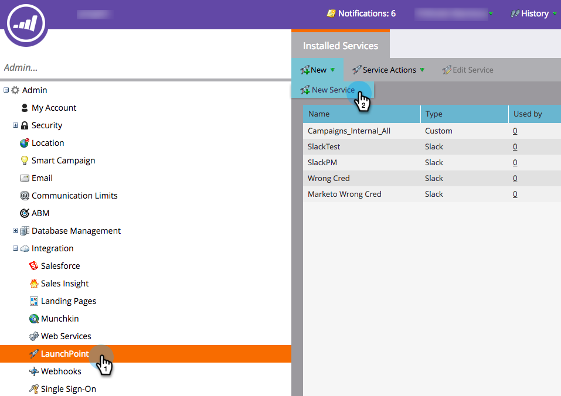

# 将Slack添加为LaunchPoint服务{#add-slack-as-a-launchpoint-service}

Slack集成中包含两种通知类型：

* **系统通知**:获取有关Marketo实例中重要事件的Slack通知，例如有关当前活动状态和任何需要立即注意的问题（CRM错误和API限制）的警报。
* **有趣的时刻**:当Marketo Insight由销售帐户中的已知个人触发时，潜在客户所有者可以通过Slack获得通知。通知包括潜在客户信息以及有关销售帐户的详细信息。

>[!NOTE]
>
>**需要管理权限**

>[!PREREQUISITES]
>
>如果您尚未启用Slack系统通知，请联系[Marketo支持](https://nation.marketo.com/t5/Support/ct-p/Support)。

1. 转至&#x200B;**LaunchPoint**，然后在&#x200B;**New**&#x200B;下单击&#x200B;**New Service**。

   

1. 输入Slack集成的显示名称。 在&#x200B;**服务**&#x200B;下拉列表中，选择&#x200B;**Slack**。 单击&#x200B;**创建**。

   

1. 单击&#x200B;**授权**。 这将在新选项卡中打开Slack，您将在该选项卡中完成授权并授予Marketo从Slack中提取信息的权限。

   

1. 在新的Slack选项卡中，输入工作区的URL，然后单击&#x200B;**继续**。

   

1. 输入您的Slack凭据，然后单击&#x200B;**登录**。

   

1. 在&#x200B;**发布到**&#x200B;下拉列表中，选择要发布Marketo通知的渠道。 查看请求的权限，然后单击&#x200B;**授权**。

   

1. 您应当看到下面的确认屏幕。 选项卡会自动关闭。

   

1. 刷新“Marketo”选项卡，并确认Slack现在在LaunchPoint中列为活动服务。

   

   通知现在将开始发布到您在步骤6中选择的渠道。 它们会像这样：

   
