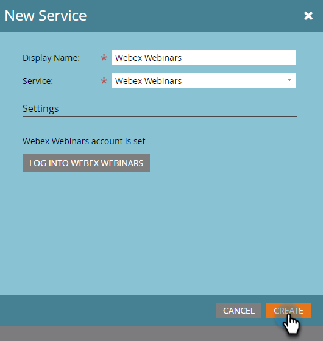

# 添加 [!DNL Webex] as a [!DNL LaunchPoint] 服务 {#add-webex-as-a-launchpoint-service}

Marketo Engage管理 [!DNL Webex] 网络研讨会注册和出席。

>[!NOTE]
>
>**需要管理员权限**

>[!NOTE]
>
>现有订阅 [!DNL Webex] 和管理权限对于此步骤是必需的。 准备好以下设置：用户名、密码和站点名称。

>[!NOTE]
>
>网站名称可在用于登录的URL的末尾找到 [!DNL Webex]. 例如：
>
>`https://mycompany.webex.com/mw0300lc/mywebex/default.do?siteurl=mycompany`
>
>**注意：** 请勿在此字段中输入整个URL；请仅输入网站名称！

1. 转到 **[!UICONTROL 管理员]** 区域。

   

1. 单击 **[!UICONTROL 启动点]**.

   

1. 选择 **[!UICONTROL 新建]** 然后 **[!UICONTROL 新建服务]**.

   

1. 输入 **[!UICONTROL 显示名称]**. 下 **[!UICONTROL 服务]**，选择 **[!UICONTROL Webex]**.

   

1. 输入您的 **[!UICONTROL 用户名]** 和 **[!UICONTROL 密码]**.

   

1. 输入您的 **[!UICONTROL 站点名称]** 然后单击 **[!UICONTROL 创建]**.

   

您的 **[!DNL Webex]** 现已与Marketo同步。

>[!MORELIKETHIS]
>
>了解如何 [创建事件 [!DNL Webex]](/help/marketo/product-docs/demand-generation/events/create-an-event/create-an-event-with-webex.md){target="_blank"}.
