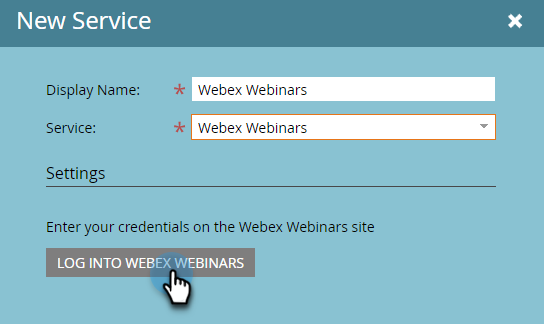
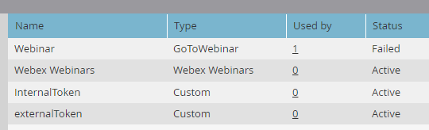

# 将[!DNL Webex]添加为[!DNL LaunchPoint]服务 {#add-webex-as-a-launchpoint-service}

Marketo Engage管理您的[!DNL Webex]网络研讨会注册和出席情况。 您必须具有对[[!UICONTROL Webex]](https://www.webex.com/)的现有订阅。

>[!NOTE]
>
>**需要管理员权限**

1. 转到&#x200B;**[!UICONTROL 管理员]**&#x200B;区域。

   

1. 单击&#x200B;**[!UICONTROL 启动点]**。

   

1. 选择&#x200B;**[!UICONTROL 新建]**，然后选择&#x200B;**[!UICONTROL 新建服务]**。

   

1. 输入&#x200B;**[!UICONTROL 显示名称]**。 在&#x200B;**[!UICONTROL 服务]**&#x200B;下拉列表中，选择&#x200B;**[!UICONTROL Webex网络研讨会]**。

   

1. 单击&#x200B;**[!UICONTROL 登录Webex网络研讨会]**。

   

1. Webex将在新选项卡中打开。 使用Webex凭据登录。

   

1. 成功登录后，选项卡将关闭，Marketo Engage中的&#x200B;_新服务_&#x200B;模式将显示为“已设置Webex网络研讨会帐户”。 单击&#x200B;**[!UICONTROL 创建]**。

   

您的&#x200B;**[!DNL Webex]**&#x200B;现已与Marketo同步。

>[!MORELIKETHIS]
>
>[创建具有 [!DNL Webex]](/help/marketo/product-docs/demand-generation/events/create-an-event/create-an-event-with-webex.md){target="_blank"}的事件。
