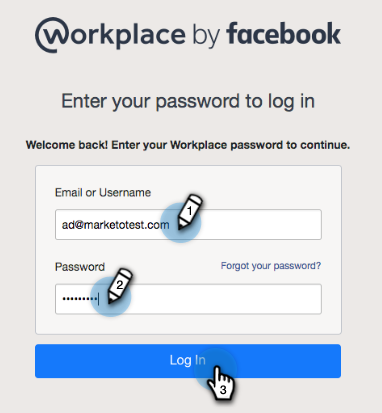

# 将Workplace By Facebook添加为LaunchPoint服务{#add-workplace-by-facebook-as-a-launchpoint-service}

工作区集成中包含两种通知类型：

* **系统通知**:获取有关Marketo实例中重要事件的工作区通知，例如有关当前活动状态和任何需要立即注意的问题（CRM错误和API限制）的警报。
* **有趣的时刻**:当Marketo Insight由来自销售帐户的已知个人触发时，可以通过工作区通知潜在客户所有者。通知包括潜在客户信息以及有关销售帐户的详细信息。

>[!NOTE]
>
>**需要管理权限**

>[!PREREQUISITES]
>
>如果您尚未启用工作区通知，请联系[Marketo支持](https://nation.marketo.com/t5/Support/ct-p/Support)。

1. 转至&#x200B;**LaunchPoint**，然后在&#x200B;**New**&#x200B;下单击&#x200B;**New Service**。

   

1. 输入工作区集成的显示名称。 在&#x200B;**Service**&#x200B;下拉列表中，选择&#x200B;**Workplace by Facebook**。 单击&#x200B;**创建**。

   

1. 要接收系统通知和有趣的时刻，请保留选项。 单击&#x200B;**创建**。

   

1. 单击&#x200B;**授权**。 这会在新选项卡中打开工作区，您将在该选项卡中完成授权并授予Marketo从工作区提取信息的权限。

   

1. 在新的“工作区”选项卡中，输入您的企业电子邮件或工作区用户名，然后单击&#x200B;**继续**。

   

1. 输入您的工作区凭据，然后单击&#x200B;**登录**。

   

1. 在“工作区”弹出窗口中，选择一个Facebook组，您希望将来自Marketo的通知发布到该组（例如，合作伙伴集成）。 单击&#x200B;**安装**。

   

1. 您应当看到下面的确认通知。 选项卡会自动关闭。

   

1. 刷新“Marketo”选项卡，并确认Workplace现在在LaunchPoint中被列为活动服务。

   

   通知现在将开始发布到您在步骤7中选择的Facebook组。 它们会像这样：

   
