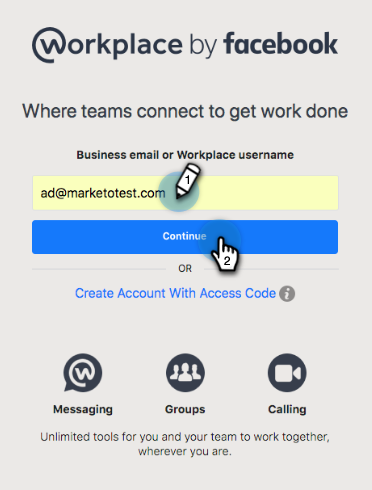

# 添加 [!DNL Workplace By Facebook] as a [!DNL LaunchPoint] 服务 {#add-workplace-by-facebook-as-a-launchpoint-service}

有两种通知类型包含在中 [!DNL Workplace] 集成：

* **系统通知**：获取 [!DNL Workplace] 有关Marketo实例中重要事件的通知，例如有关当前营销活动状态的警报以及任何需要立即关注的问题（CRM错误和API限制）。
* **有趣的时刻**：当 [!DNL Marketo Insight] 是由销售帐户中的已知个人触发的，可以通过以下方式通知潜在客户所有者 [!DNL Workplace]. 通知包括潜在客户信息以及有关销售帐户的详细信息。

>[!NOTE]
>
>**需要管理员权限**

>[!PREREQUISITES]
>
>如果您没有 [!DNL Workplace] 通知已启用，请联系 [Marketo支持](https://nation.marketo.com/t5/Support/ct-p/Support){target="_blank"}.

1. 转到 **[!UICONTROL 管理员]** 区域。

   

1. 单击 **[!UICONTROL 启动点]**.

   

1. 选择 **[!UICONTROL 新]** 然后 **[!UICONTROL 新服务]**.

   

1. 输入 **[!UICONTROL 显示名称]** 您的 [!DNL Workplace] 集成。 在 **[!UICONTROL 服务]** 下拉列表，选择 **[!UICONTROL 按Facebook列出的工作区]**. 单击&#x200B;**[!UICONTROL 创建]**。

   

1. 要接收系统通知和有趣的时刻，请保持选项不变。 单击&#x200B;**[!UICONTROL 创建]**。

   

1. 单击 **[!UICONTROL 授权]**. 这将打开 [!DNL Workplace] 在新选项卡中，您将完成授权并授予Marketo从中提取信息的权限 [!DNL Workplace].

   

1. 新增 [!DNL Workplace] 选项卡，输入您的业务电子邮件或 [!DNL Workplace] 用户名，然后单击 **[!UICONTROL 继续]**.

   

1. 输入您的 [!DNL Workplace] 凭据，然后单击 **[!UICONTROL 登录]**.

   

1. 在 [!DNL Workplace] 弹出窗口，选择 [!DNL Facebook] 您希望将Marketo通知发布到的组(例如， [!UICONTROL 合作伙伴集成])。 单击 **[!UICONTROL 安装]**.

   

1. 您应会看到下面的确认通知。 选项卡会自动关闭。

   

1. 刷新“Marketo”选项卡并确认 [!DNL Workplace] 现已列为中的有效服务 [!DNL LaunchPoint].

   

   通知现在将开始发布到 [!DNL Facebook] 您在步骤7中选择的组。 它们看起来会像这样：

   
