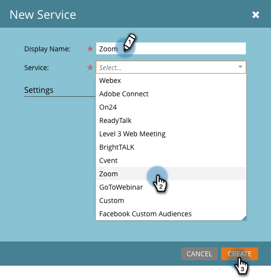

# 将[!DNL Zoom]添加为[!DNL LaunchPoint]服务 {#add-zoom-as-a-launchpoint-service}

Marketo管理您的[!DNL Zoom]注册和出席情况。

>[!NOTE]
>
>**需要管理员权限**

>[!NOTE]
>
>此步骤需要[!DNL Zoom]的现有订阅和管理权限。 准备好用于登录到[!DNL Zoom]的电子邮件和密码。

1. 进入 **[!UICONTROL Admin]** 区域。

   

1. 单击 **[!UICONTROL LaunchPoint]**。

   

1. 选择&#x200B;**[!UICONTROL New]**，然后选择&#x200B;**[!UICONTROL New Service]**。

   

1. 输入&#x200B;**[!UICONTROL Display Name]**。 在&#x200B;**[!UICONTROL Service]**&#x200B;下，选择&#x200B;**[!UICONTROL Zoom]**。

   

1. 单击 **[!UICONTROL Log Into Zoom]**。

   

1. 在[!DNL Zoom]登录窗口中，输入您的[!DNL Zoom]凭据，然后单击&#x200B;**[!UICONTROL Sign in]**。

   

1. 窗口关闭后，单击&#x200B;**[!UICONTROL Create]**。

   

您的[!DNL Zoom]帐户现在已与Marketo同步，并且可以在[!UICONTROL LaunchPoint]区域找到。

>[!CAUTION]
>
>当您在[!DNL Zoom]中更新密码时，还必须在Marketo中更新密码。

>[!MORELIKETHIS]
>
>了解如何[使用 [!DNL Zoom]](/help/marketo/product-docs/demand-generation/events/create-an-event/create-an-event-with-zoom.md)创建事件。
