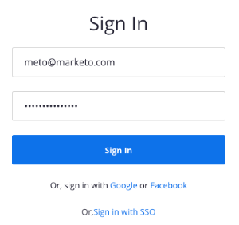

# 添加 [!DNL Zoom] as a [!DNL LaunchPoint] 服务 {#add-zoom-as-a-launchpoint-service}

Marketo管理您的 [!DNL Zoom] 注册及出席情况。

>[!NOTE]
>
>**需要管理员权限**

>[!NOTE]
>
>现有订阅 [!DNL Zoom] 和管理权限对于此步骤是必需的。 拥有用于登录的电子邮件和密码 [!DNL Zoom] 手上。

1. 转到 **[!UICONTROL 管理员]** 区域。

   

1. 单击 **[!UICONTROL 启动点]**.

   

1. 选择 **[!UICONTROL 新]** 然后 **[!UICONTROL 新服务]**.

   

1. 输入 **[!UICONTROL 显示名称]**. 下 **[!UICONTROL 服务]**，选择 **[!UICONTROL 缩放]**.

   

1. 单击 **[!UICONTROL 登录缩放]**.

   

1. 在 [!DNL Zoom] 登录窗口，输入您的 [!DNL Zoom] 凭据，然后单击 **[!UICONTROL 登录]**.

   

1. 关闭窗口后，单击 **[!UICONTROL 创建]**.

   

您的 [!DNL Zoom] 帐户现已与Marketo同步，并且可以在 [!UICONTROL 启动点] 区域。

>[!CAUTION]
>
>在Zoom中更新密码时，还必须在Marketo中更新密码。

>[!MORELIKETHIS]
>
>了解如何 [创建事件，使用 [!DNL Zoom]](/help/marketo/product-docs/demand-generation/events/create-an-event/create-an-event-with-zoom.md).
