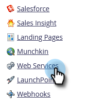

# 配置SOAP API设置 {#configuring-your-soap-api-settings}

>[!NOTE]
>
>我们建议使用REST API。 在[developer.adobe.com](https://developer.adobe.com/marketo-apis/)上了解详情。

>[!NOTE]
>
>**需要管理员权限**

1. 转到&#x200B;**[!UICONTROL 管理员]**&#x200B;区域。

   

1. 单击&#x200B;**[!UICONTROL Web服务]**。

   

1. 设置适当的&#x200B;**[!UICONTROL 加密密钥]**，单击&#x200B;**[!UICONTROL 保存更改]**，然后将所有信息传递给开发人员。

   

>[!CAUTION]
>
>您的SOAP端点和[!UICONTROL 用户ID]将是唯一的；请勿将此文章中的屏幕快照发送给您的开发人员。

>[!MORELIKETHIS]
>
>[SOAP API文档](https://experienceleague.adobe.com/zh-hans/docs/marketo-developer/marketo/soap/soap-api)
