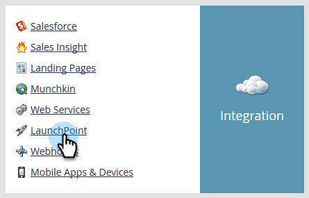
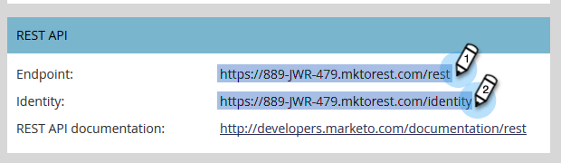

# 将[!DNL BrightTALK]连接到Marketo {#connect-brighttalk-to-marketo}

了解如何将您的[!DNL BrightTALK]渠道连接到Marketo实例。 为此，您必须是两者的管理员。

>[!NOTE]
>
>**需要管理员权限**

## [!DNL BrightTALK]中的步骤 {#steps-in-brighttalk}

1. 登录到[business.brighttalk.com/demandcentral](https://business.brighttalk.com/demandcentral/login){target="_blank"}并单击&#x200B;**[!UICONTROL Connect Now]**。

1. 在[!UICONTROL Advanced Marketo Connector]下，单击&#x200B;**[!UICONTROL Connect]**。

1. 此时将显示凭据屏幕，询问以下内容：客户端ID、客户端密钥、标识服务URL和Rest服务URL。 要获取此信息，请登录Marketo。

## Marketo的步骤 {#steps-in-marketo}

>[!NOTE]
>
>此时，您需要设置[!DNL API Only User Role]和[!DNL API User]，以限制[!DNL BrightTALK]在您的Marketo实例中拥有的权限。 有文章可用于这些步骤。

1. 创建[仅API用户角色](/help/marketo/product-docs/administration/users-and-roles/create-an-api-only-user-role.md){target="_blank"}。

1. [使用您在步骤4中创建的[!DNL BrightTALK] API角色创建API用户](/help/marketo/product-docs/administration/users-and-roles/create-api-only-user.md){target="_blank"}。

1. 返回&#x200B;**[!UICONTROL Admin]**&#x200B;区域。

   

1. 在&#x200B;**[!UICONTROL Integration]**&#x200B;下，单击&#x200B;**[!UICONTROL LaunchPoint]**。

   

1. 点击 **[!UICONTROL New]** 下拉菜单，并选择 **[!UICONTROL New Service]**。

   

1. 输入您选择的&#x200B;**[!UICONTROL Display Name]**。 单击&#x200B;**[!UICONTROL Service]**&#x200B;下拉菜单并选择&#x200B;**[!UICONTROL Custom]** （请&#x200B;_不_&#x200B;选择[!DNL BrightTALK]）。

   

   >[!CAUTION]
   >
   >切记不要在下拉列表中选择[!DNL BrightTALK]。 此字段正在删除中，选择它可能会导致您的[!DNL Marketo/BrightTALK]集成产生严重问题。

1. 输入您选择的[!UICONTROL Description]。 单击&#x200B;**[!UICONTROL API Only User]**&#x200B;下拉列表并选择您在步骤5中创建的[!DNL BrightTALK API User]。 单击 **[!UICONTROL Create]**。

   

1. 单击刚刚创建的自定义服务的&#x200B;**[!UICONTROL View Details]**。

   

1. 复制（并保存）**[!UICONTROL Client ID]**&#x200B;和&#x200B;**[!UICONTROL Client Secret]**。 单击 **[!UICONTROL Close]**。

   

1. 在&#x200B;**[!UICONTROL Integration]**&#x200B;下，选择&#x200B;**[!UICONTROL Web Services]**。

   

1. 在&#x200B;**[!UICONTROL Rest API]**&#x200B;下，复制（并保存）**[!UICONTROL Endpoint]**&#x200B;和&#x200B;**[!UICONTROL Identity]**。

   

## [!DNL BrightTALK]中的其他步骤 {#additional-steps-in-brighttalk}

1. 从步骤3返回到[!DNL BrightTALK]连接器设置屏幕，并输入您在步骤12和14中保存的凭据。

凭据通过身份验证后，您已正式将[!DNL BrightTALK]连接到Marketo。 下一步是确定要同步的数据字段。 如果您需要这方面的帮助，请联系[BrightTALK支持](https://www.brighttalk.com/){target="_blank"}。
