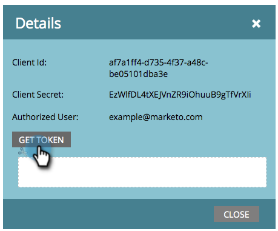

# 创建用于ReST API的自定义服务 {#create-a-custom-service-for-use-with-rest-api}

如果要通过ReST API与Marketo集成，则需要创建自定义服务。 这是方法。

>[!PREREQUISITES]
>
>* [创建仅API用户角色](/help/marketo/product-docs/administration/users-and-roles/create-an-api-only-user-role.md)
>* [仅创建API用户](/help/marketo/product-docs/administration/users-and-roles/create-an-api-only-user.md)
>

>[!NOTE]
>
>**需要管理员权限**

>[!TIP]
>
>有关 [ReST API](https://developers.marketo.com/documentation/rest/). 我们还有 [SOAP API](https://developers.marketo.com/documentation/soap/) 如果你需要的话。

## 创建自定义服务 {#create-custom-service}

1. 转到 **管理员** 的上界。

   

1. 单击 **LaunchPoint**.

   

1. 选择 **新建** 然后 **新服务**.

   

1. 输入 **显示名称** 服务。 选择 **仅限API用户** [之前创建的](/help/marketo/product-docs/administration/users-and-roles/create-an-api-only-user.md).

   

   >[!NOTE]
   >
   >请注意，我们已经拥有用于热门网络研讨会服务的本机集成。

1. 单击 **创建**.

   

   对！ 该服务现已创建完成，让我们继续获取提供访问权限的所有凭据。

## API访问凭据 {#credentials-for-api-access}

1. 转到 **管理员** 的上界。

   

1. 单击 **LaunchPoint**.

   

1. 单击 **查看详细信息** ，用于上面创建的自定义LaunchPoint服务。

   

1. 单击 **获取令牌**.

   

1. 提供 **客户端Id**, **客户端密钥**, **授权用户**&#x200B;和 **令牌** 联系的负责人。

   

>[!CAUTION]
>
>不要共享此信息；这是你数据的后门。 保安！
