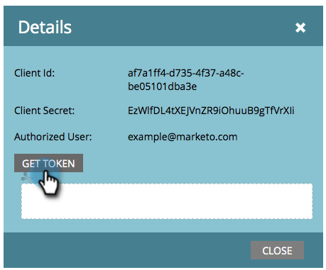

# 创建用于 ReST API 的自定义服务 {#create-a-custom-service-for-use-with-rest-api}

如果要通过ReST API与Marketo集成，请创建自定义服务。

>[!PREREQUISITES]
>
>* [创建仅API用户角色](/help/marketo/product-docs/administration/users-and-roles/create-an-api-only-user-role.md)
>* [创建仅API用户](/help/marketo/product-docs/administration/users-and-roles/create-api-only-user.md)
>

>[!NOTE]
>
>**需要管理员权限**

>[!TIP]
>
>有关[REST API](https://developer.adobe.com/marketo-apis/)的详细信息，请参阅开发人员文档。

## 创建自定义服务 {#create-custom-service}

1. 进入 **[!UICONTROL Admin]** 区域。

   

1. 单击 **[!UICONTROL LaunchPoint]**。

   

1. 选择&#x200B;**[!UICONTROL New]**，然后选择&#x200B;**[!UICONTROL New Service]**。

   

1. 输入服务的&#x200B;**[!UICONTROL Display Name]**。 选择&#x200B;**[!UICONTROL API Only User]** [之前创建的](/help/marketo/product-docs/administration/users-and-roles/create-api-only-user.md)。

   

1. 单击 **[!UICONTROL Create]**。

   

   现已创建该服务。 检索凭据以提供访问权限。

## 用于访问API的凭据 {#credentials-for-api-access}

1. 进入 **[!UICONTROL Admin]** 区域。

   

1. 单击 **[!UICONTROL LaunchPoint]**。

   

1. 单击上面创建的自定义[!UICONTROL LaunchPoint]服务的&#x200B;**[!UICONTROL View Details]**。

   

1. 单击 **[!UICONTROL Get Token]**。

   

1. 将&#x200B;**[!UICONTROL Client Id]**、**[!UICONTROL Client Secret]**、**[!UICONTROL Authorized User]**&#x200B;和&#x200B;**[!UICONTROL Token]**&#x200B;提供给负责建立连接的人员。

   

>[!CAUTION]
>
>不要共享此信息，因为它提供了对数据的访问。
