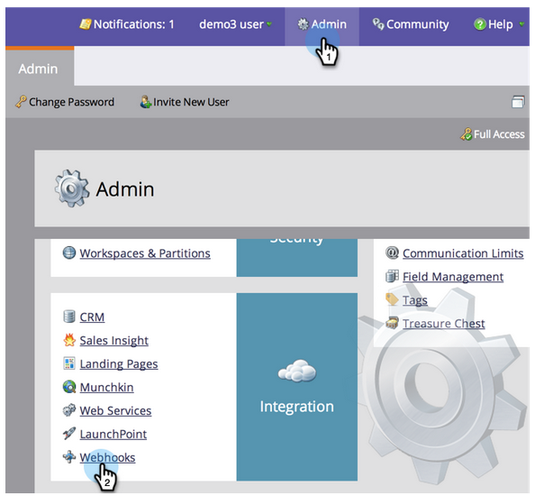
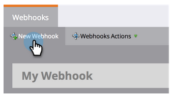

# 创建Webhook {#create-a-webhook}

使用webhooks可利用第三方Web服务发送文本消息、扩展人员数据等。

>[!AVAILABILITY]
>
>并非所有客户都购买了此功能。 有关详细信息，请与您的销售代表联系。

1. 转至&#x200B;**Admin**&#x200B;并单击&#x200B;**Webhooks**。

   

1. 单击&#x200B;**新建Webhook**。

   

1. 命名并配置您的Webhook。

   

   >[!NOTE]
   >
   >这通常包括将您的第三方服务凭据输入为URL参数或在POST模板中。

   * **URL**:输入用于POST对Web服务的请求的URL。要在您的请求中插入令牌，如人员的电子邮件地址(**`{{lead.Email Address}}`**)，请单击&#x200B;**插入令牌**。

   * **模板**:如果要在POST正文中传输信息，请输入模板。使用支持HTTPPOST的任何数据格式，包括XML、JSON或SOAP。 要在模板中插入令牌，请单击&#x200B;**插入令牌**。

   * **请求令牌编码**:如果令牌值包含特殊字符（如“&amp;”），请指示请求的格式(**** JSON或 **表单/Url**)。

   * **响应类型**:选择您从服务（JSON或XML）接收的&#x200B;**** 响应 **的格**&#x200B;式。

   单击创建。

   

>[!NOTE]
>
>在[webhooks](https://developers.marketo.com/documentation/webhooks/)深入了解更多信息。
