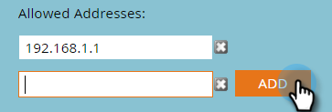

# 为基于IP的API访问创建允许列表 {#create-an-allowlist-for-ip-based-api-access}

有时，您只想授予API访问特定IP地址或某个地址范围的权限。 为此，首先要启用限制，然后指定允许使用API的IP地址。

>[!NOTE]
>
>**需要管理员权限**

1. 转到 **[!UICONTROL 管理员]** 区域。

   

1. 单击 **[!UICONTROL Web服务]**.

   

1. 在 **[!UICONTROL IP限制]** 区域，单击 **[!UICONTROL 编辑]，** 或单击 **[!UICONTROL 编辑IP限制]** 左上角。

   

1. 查看 **[!UICONTROL 启用IP限制]** 框中输入要允许列表的IP地址。

   

   >[!NOTE]
   >
   >您可以输入单个IP地址或一个IP地址范围，也可以使用通配符。

1. 单击 **[!UICONTROL 添加]** 打开其他字段以输入更多IP地址。

   

1. 单击 **[!UICONTROL 保存]**.

   
