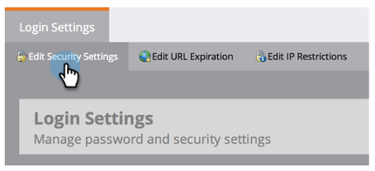

# 限制用户仅登录SSO {#restrict-user-login-to-sso-only}

如果您 [使用SSO](/help/marketo/product-docs/administration/additional-integrations/add-single-sign-on-to-a-portal.md) 并且要确保用户无法绕过单点登录(SSO)安全，请按照以下说明操作。

>[!IMPORTANT]
>
>本条不适用于 [启用了Adobe IMS](/help/marketo/product-docs/administration/marketo-with-adobe-identity/adobe-identity-management-overview.md) Marketo订阅。

>[!NOTE]
>
>**需要管理员权限**

1. 转到 **管理员** 单击 **登录设置**.

   

1. 单击 **编辑安全设置**.

   

1. 展开高级设置，选中 **需要单点登录**，然后单击 **保存**.

>[!NOTE]
>
>最佳实践是邀请用户并接受邀请。 _之后_ 接受邀请后，管理员应将其设置为“需要单点登录”。

>[!TIP]
>
>如果您选择 **需要单点登录**，您可以 [用户角色](/help/marketo/product-docs/administration/users-and-roles/create-delete-edit-and-change-a-user-role.md) 通过检查 **绕过单点登录** 选项。 这将允许用户正常登录。 例如，管理员用户可能仍需要通过登录屏幕登录Marketo。

>[!CAUTION]
>
>当新用户受邀时，他们会收到邀请电子邮件。 但是，如果 **需要单点登录** ，则他们将不会收到这些电子邮件，除非他们被分配到的角色设置为 **绕过单点登录**.

就这样！ 现在，所有用户（具有绕过单点登录权限的用户除外）都将限制为仅使用单点登录。

>[!MORELIKETHIS]
>
>* [将单点登录添加到门户](/help/marketo/product-docs/administration/additional-integrations/add-single-sign-on-to-a-portal.md)
>* [使用通用ID进行订阅登录](/help/marketo/product-docs/administration/settings/using-a-universal-id-for-subscription-login.md)
>* [邀请Marketo用户加入两个具有通用ID的实例](https://nation.marketo.com/t5/Knowledgebase/Inviting-Marketo-Users-to-Two-Instances-with-Universal-ID-UID/ta-p/251122)

