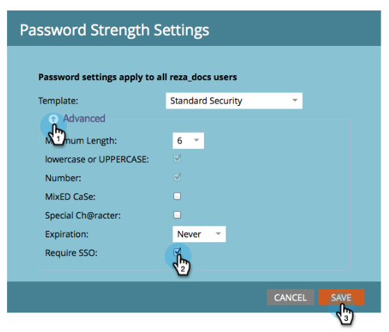

# 限制用户仅登录SSO {#restrict-user-login-to-sso-only}

如果您[正在使用SSO](/help/marketo/product-docs/administration/additional-integrations/add-single-sign-on-to-a-portal.md)，并且希望确保用户无法绕过SSO安全，请按照以下说明进行操作。

>[!IMPORTANT]
>
>本文不适用于[已启用IMS的Adobe ](/help/marketo/product-docs/administration/marketo-with-adobe-identity/adobe-identity-management-overview.md) Marketo订阅。

>[!NOTE]
>
>**需要管理员权限**

1. 转到&#x200B;**[!UICONTROL 管理员]**&#x200B;区域。

   

1. 单击&#x200B;**[!UICONTROL 登录设置]s**。

   

1. 单击&#x200B;**[!UICONTROL 编辑安全设置]**。

   

1. 展开&#x200B;**[!UICONTROL 高级]**&#x200B;设置，选中&#x200B;**[!UICONTROL 需要SSO]**，然后单击&#x200B;**[!UICONTROL 保存]**。

>[!NOTE]
>
>最佳做法是邀请用户并接受邀请。 _在_&#x200B;邀请被接受后，管理员应将其设置为“[!UICONTROL 需要SSO]”。

>[!TIP]
>
>如果选择&#x200B;**[!UICONTROL 要求SSO]**，则可以通过在设置角色时选中&#x200B;**[!UICONTROL 绕过单点登录]**&#x200B;选项来将[用户角色](/help/marketo/product-docs/administration/users-and-roles/create-delete-edit-and-change-a-user-role.md)从此限制中排除。 这将允许用户正常登录。 例如，管理员用户可能仍需要通过登录屏幕登录Marketo。 如果同时启用了SSO和通用ID，则必须设置“绕过单点登录”权限以在订阅之间切换。

>[!CAUTION]
>
>邀请新用户时，他们将收到邀请电子邮件。 但是，如果选择&#x200B;**[!UICONTROL 要求SSO]**，他们将不会收到这些电子邮件，除非将其分配给设置为&#x200B;**[!UICONTROL 绕过单点登录]**&#x200B;的角色。

操作完成！现在，所有用户（有权绕过单点登录的用户除外）将被限制为仅使用SSO登录。

>[!MORELIKETHIS]
>
>* [将单点登录添加到门户](/help/marketo/product-docs/administration/additional-integrations/add-single-sign-on-to-a-portal.md)
>* [使用通用ID进行订阅登录](/help/marketo/product-docs/administration/settings/using-a-universal-id-for-subscription-login.md)
>* [邀请Marketo用户使用通用ID访问两个实例](https://nation.marketo.com/t5/Knowledgebase/Inviting-Marketo-Users-to-Two-Instances-with-Universal-ID-UID/ta-p/251122)
