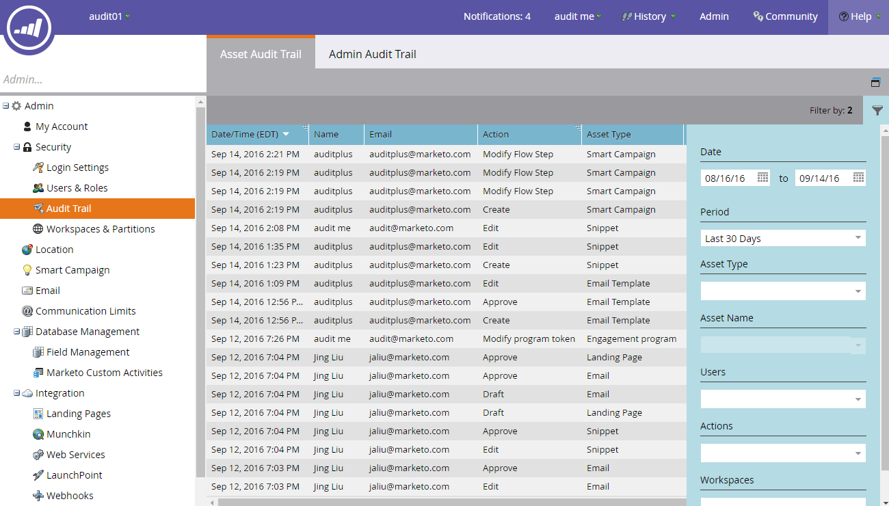

# 审计线索概述{#audit-trail-overview}

审计线索使您能够获得在Marketo实例中所做更改的完整历史记录（6个月）。

>[!NOTE]
>
>自2016年9月14日起，审计线索数据历史开始。

## 什么是审核跟踪{#what-is-audit-trail}

审计线索可实时捕获在Marketo订阅中发生的操作和事件的全面列表。 它包括一种自助方式，访问为期6个月的数据历史，以帮助回答以下问题：

此资产或设置发生了什么情况，谁上次更新了它？

X用户进行了哪些操作？

谁正在登录我们的帐户？

## 我们审计的{#what-we-audit}

Marketo将审核[创建、编辑和删除](/help/marketo/product-docs/administration/audit-trail/change-details-in-audit-trail.md)操作，用于：

* Design Studio资源
* 所有Marketo项目
* 智能活动
* 列表（智能/静态）
* 用户（管理员）
* 角色和权限（管理员）
* 工作区和分区（管理员）
* 用户登录历史记录

>[!NOTE]
>
>Marketo此时是&#x200B;_不_&#x200B;审核在Web Personalization、Predictive Content或Sales Insight中所做的更改。

## 审核跟踪组件{#audit-trail-components}

审核跟踪包括三个组件。

**1)资 [产审核跟踪](/help/marketo/product-docs/administration/audit-trail/change-details-in-audit-trail.md#asset-audit-trail)**

查看对特定资产进行的活动。

**2)管 [理审计线索](/help/marketo/product-docs/administration/audit-trail/change-details-in-audit-trail.md#admin-audit-trail)**

监视基于用户的详细信息。

**3)用 [户登录历史记录](/help/marketo/product-docs/administration/audit-trail/user-login-history.md)**

查看谁正在登录您的订阅以及登录时间。 还包括失败的登录尝试。

>[!TIP]
>
>您可以使用审核跟踪进行审核，请务必使用[筛选](/help/marketo/product-docs/administration/audit-trail/filtering-in-audit-trail.md)!

## 导出数据{#exporting-data}

您只能视图实例中价值30天的数据。 要获得（最多）六个月的价值，请使用出口选项。

>[!NOTE]
>
>**定义**
>
>**未知：** 在审计跟踪中，您可能会看到用户名和电子邮件列为“未知”。当您在CRM中更改选择列表值时，会发生这种情况。 这些值显示在Marketo表单和登陆页中。 在CRM端执行此更新将自动草拟引用表单的登陆页。 在审计跟踪中，我们将捕获登陆页已起草，但用户的名称和电子邮件将显示为“未知”，因为我们无法从CRM端捕获用户信息。

>[!MORELIKETHIS]
>
>[启用审核跟踪](/help/marketo/product-docs/administration/audit-trail/enable-audit-trail.md)
