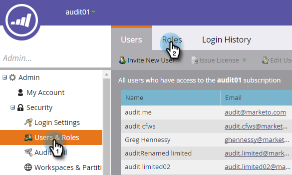

# 启用审核跟踪{#enable-audit-trail}

审核跟踪对所有客户都可用，并由两种管理权限控制。

>[!NOTE]
>
>默认情况下，所有系统管理员角色都启用了这两个权限。

## 为角色{#enable-audit-trail-for-a-role}启用审核跟踪

1. 单击&#x200B;**管理员**。

   

1. 选择&#x200B;**“用户和角色”**，然后单击&#x200B;**“角色”**。

   

1. 选择要为其启用审核跟踪的角色，然后单击&#x200B;**编辑角色**。

   

   >[!NOTE]
   >
   >您还可以在此处选择创建新角色并授予其“审核跟踪”访问权限。

1. 展开&#x200B;**访问管理员**&#x200B;权限。 根据您的需要，选择&#x200B;**访问审核跟踪**&#x200B;和/或&#x200B;**访问登录历史记录**。 单击&#x200B;**保存**。

   

   >[!NOTE]
   >
   >**定义**
   >
   >**访问审核跟踪：** 允许用户同时访问资产审核跟踪和管理员审核跟踪。
   >
   >**访问登录历史记录：** 允许用户访问用 [户登录历史记录](/help/marketo/product-docs/administration/audit-trail/user-login-history.md)。

## 为用户{#assign-audit-trail-role-to-a-user}分配审核跟踪角色

>[!PREREQUISITES]
>
>[创](/help/marketo/product-docs/administration/users-and-roles/create-delete-edit-and-change-a-user-role.md#create-a-role) 建或启  用现有角色，为其授予“审核跟踪”权限。

1. 在&#x200B;**Users &amp; Roles**&#x200B;中，单击&#x200B;**Users**。

   

1. 选择要授予“审核跟踪”访问权限的用户，然后单击&#x200B;**编辑用户**。

   

   >[!NOTE]
   >
   >创建新用户时，也会应用此过程。

1. 选择您创建的审核跟踪角色。 在此示例中，我们创建了“审核跟踪 — 资产和管理员”和“审核跟踪 — 登录历史记录”。

   

   >[!CAUTION]
   >
   >如果已启用工作区，请确保选中角色的复选框，该复选框将选择所有工作区。 取消选择单个工作区将隐藏审核跟踪。 这意味着您将看到每个工作区的审核跟踪数据。 当[筛选](/help/marketo/product-docs/administration/audit-trail/filtering-in-audit-trail.md)时，您确实可以隐藏工作区。

1. 单击&#x200B;**保存**。

   
