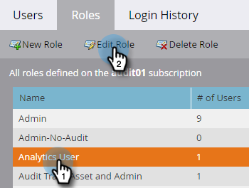

# 启用审核记录 {#enable-audit-trail}

审核记录对所有客户都可用，并受两个管理员权限控制。

>[!NOTE]
>
>默认情况下，所有系统管理员角色都启用这两个权限。

## 为角色启用审核跟踪 {#enable-audit-trail-for-a-role}

1. 点击 **[!UICONTROL Admin]**。

   

1. 选择 **[!UICONTROL Users & Roles]** 并点击 **[!UICONTROL Roles]**。

   

1. 选择要为其启用审核跟踪的角色，然后单击&#x200B;**[!UICONTROL Edit Role]**。

   

   >[!NOTE]
   >
   >您还可以选择在此创建新角色并授予其审核记录访问权限。

1. 展开&#x200B;**[!UICONTROL Access Admin]**&#x200B;权限。 选择&#x200B;**[!UICONTROL Access Audit Trail]**&#x200B;和/或&#x200B;**[!UICONTROL Access Login History]**，具体取决于您的需要。 单击 **[!UICONTROL Save]**。

   

   >[!NOTE]
   >
   >**定义**
   >
   >**[!UICONTROL Access Audit Trail]**：授予用户访问[!UICONTROL Asset Audit Trail]和[!UICONTROL Admin Audit Trail]的权限。
   >
   >**[!UICONTROL Access Login History]**：授予用户访问[用户登录历史记录](/help/marketo/product-docs/administration/audit-trail/user-login-history.md)的权限。

## 将审核跟踪角色分配给用户 {#assign-audit-trail-role-to-a-user}

>[!PREREQUISITES]
>
>[创建](/help/marketo/product-docs/administration/users-and-roles/create-delete-edit-and-change-a-user-role.md#create-a-role)或[启用](#enable-audit-trail)现有的角色，为其授予审核记录权限。

1. 在&#x200B;**[!UICONTROL Users & Roles]**&#x200B;中，单击&#x200B;**[!UICONTROL Users]**。

   

1. 选择要授予其审核记录访问权限的用户，然后单击&#x200B;**[!UICONTROL Edit User]**。

   

   >[!NOTE]
   >
   >创建新用户时此过程也适用。

1. 选择您创建的审计线索角色。 在此示例中，我们创建了“审核记录 — 资产和管理员”以及“审核记录 — 包含登录历史记录”。

   

   >[!CAUTION]
   >
   >如果已启用工作区，请确保选中角色的复选框，该复选框将选择所有工作区。 取消选择单个工作区将隐藏审核跟踪。 这意味着您将看到每个工作区的审核记录数据。 在[筛选](/help/marketo/product-docs/administration/audit-trail/filtering-in-audit-trail.md)时，您可以选择隐藏工作区。

1. 单击 **[!UICONTROL Save]**。

   
