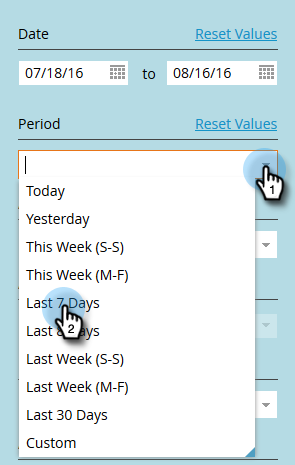

# 在审核跟踪{#filtering-in-audit-trail}中筛选

按时间范围、资产类型、用户、所采取的操作等进行筛选。

1. 单击&#x200B;**管理员**。

   

1. 在&#x200B;**Security**&#x200B;下，选择&#x200B;**审核跟踪**。

   

1. 单击过滤器图标。

   

   >[!NOTE]
   >
   >可能的搜索参数组合有很多种。 在此示例中，我们找到：_所有电子邮件 — 由任何人编辑 — 在前七天_&#x200B;中。

1. 单击&#x200B;**期间**&#x200B;下拉框并选择&#x200B;**最近7天**。

   

1. 单击&#x200B;**资产类型**&#x200B;下拉列表，然后选择&#x200B;**电子邮件**。

   

1. 单击&#x200B;**Actions**&#x200B;下拉框并选择&#x200B;**Edit**。

   

1. 单击&#x200B;**应用**。

   

1. 筛选结果显示在左侧。

   

   就这样！

   >[!NOTE]
   >
   >如果启用了工作区，您将看到所有工作区的审核数据。 如果应用工作区过滤器，Marketo会在您每次使用审核跟踪时记住以前的工作区值。 资产级别的工作区权限将得以实施。

   >[!MORELIKETHIS]
   >
   >[更改审计线索中的详细信息](/help/marketo/product-docs/administration/audit-trail/change-details-in-audit-trail.md)
