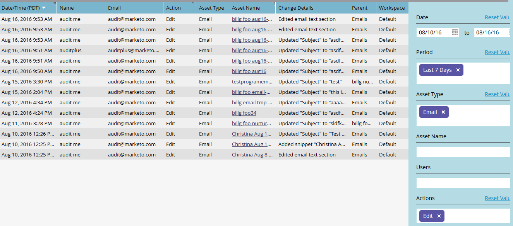

# 在审核记录中筛选 {#filtering-in-audit-trail}

按时间范围、资源类型、用户、采取的操作等过滤。

1. 单击 **[!UICONTROL Admin]**。

   

1. 在&#x200B;**[!UICONTROL Security]**&#x200B;下，选择&#x200B;**[!UICONTROL Audit Trail]**。

   

1. 单击过滤器图标。

   

   >[!NOTE]
   >
   >有许多可能的搜索参数组合。 此示例查找：_所有在前七天_&#x200B;由任何人编辑的电子邮件。

1. 点击 **[!UICONTROL Period]** 下拉菜单，并选择 **[!UICONTROL Last 7 Days]**。

   

1. 点击 **[!UICONTROL Asset Type]** 下拉菜单，并选择 **[!UICONTROL Email]**。

   

1. 点击 **[!UICONTROL Actions]** 下拉菜单，并选择 **[!UICONTROL Edit]**。

   

1. 单击 **[!UICONTROL Apply]**。

   

1. 过滤的结果显示在左侧。

   

   >[!NOTE]
   >
   >如果已启用工作区，则会看到所有工作区的审核数据。 如果应用工作区筛选器，Marketo会在每次使用审核跟踪时记住上一个工作区值。 强制实施资源级别的Workspace权限。

   >[!MORELIKETHIS]
   >
   >[更改审核记录中的详细信息](/help/marketo/product-docs/administration/audit-trail/change-details-in-audit-trail.md)
