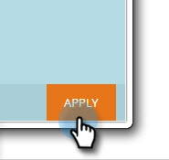

# 用户登录历史记录{#user-login-history}

“用户登录历史记录”通过向您准确显示哪些人登录了您的订阅（包括失败的登录尝试）来帮助维护责任和安全性。

>[!PREREQUISITES]
>
>您必须具有已启用“访问登录历史记录”权限的角色，才能视图用户登录历史记录。

用户登录历史记录标识登录者：

* 登录时间和日期
* 用户名和电子邮件地址
* 职位
* 工作区
* IP地址

要视图用户登录历史记录：

1. 单击&#x200B;**Admin**&#x200B;选项卡，在“Security（安全）”下，单击&#x200B;**Users &amp; Roles**。

   

1. 单击&#x200B;**登录历史记录**&#x200B;选项卡。 列表显示最近登录的信息。

   

1. 使用过滤器缩小搜索范围。

   

1. 使用日期选择器选择日期范围。

   

1. 或者，从下拉菜单中选择。

   

1. 从&#x200B;**Users**&#x200B;下拉列表中选择用户。

   

1. 选中&#x200B;**仅失败登录**&#x200B;框，在搜索中仅显示失败登录。

   

1. 单击&#x200B;**应用**。

   

   >[!NOTE]
   >
   >用户界面显示多达30天的数据。 如果需要更多，可以将最近六个月的数据下载到csv文件中。

   >[!NOTE]
   >
   >[审计线索概述](/help/marketo/product-docs/administration/audit-trail/audit-trail-overview.md)
