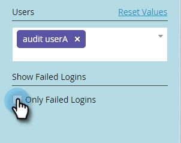

# 用户登录历史记录 {#user-login-history}

用户登录历史记录通过向您显示确切的登录订阅用户（包括失败的登录尝试），帮助维护责任感和安全性。

>[!PREREQUISITES]
>
>您必须具有启用了访问登录历史记录权限的角色才能查看用户登录历史记录。

用户登录历史记录标识通过以下方式登录的人员：

* 登录时间和日期
* 用户名和电子邮件地址
* 职位
* 工作区
* IP地址

要查看用户登录历史记录，请执行以下操作：

1. 转到 **[!UICONTROL 管理员]** 区域。

   

1. 在“安全”下，单击 **[!UICONTROL 用户和角色]**.

   

1. 单击 **[!UICONTROL 登录历史记录]** 选项卡。 该列表显示了最近登录的次数。

   

1. 使用过滤器缩小搜索范围。

   

1. 使用日期选取器选择日期范围。

   

1. 或者，从下拉列表中选择。

   

1. 从中选择用户 **[!UICONTROL 用户]** 下拉菜单。

   

1. 查看 **[!UICONTROL 仅失败的登录]** 框，仅显示搜索中失败的登录。

   

1. 单击 **[!UICONTROL 应用]**.

   

   >[!NOTE]
   >
   >用户界面显示最多30天的数据。 如果您需要更多数据，可以将最近六个月的数据下载到csv文件。

   >[!MORELIKETHIS]
   >
   >[审核记录概述](/help/marketo/product-docs/administration/audit-trail/audit-trail-overview.md)
