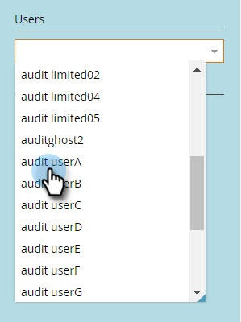
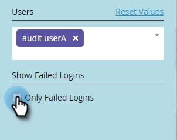

# 用户登录历史记录 {#user-login-history}

用户登录历史记录通过向您准确显示哪些人登录了您的订阅（包括失败的登录尝试），从而帮助维护责任感和安全性。

>[!PREREQUISITES]
>
>您必须具有启用了访问登录历史记录权限的角色才能查看用户登录历史记录。

“用户登录历史记录”标识按以下方式登录的人员：

* 登录时间和日期
* 用户名称和电子邮件地址
* 角色
* 工作区
* IP地址

要查看用户登录历史记录，请执行以下操作：

1. 进入 **[!UICONTROL Admin]** 区域。

   

1. 在“安全性”下，单击&#x200B;**[!UICONTROL Users & Roles]**。

   

1. 单击 **[!UICONTROL Login History]** 选项卡。 此列表显示了最近登录的内容。

   

1. 使用“筛选器”可缩小搜索范围。

   

1. 使用日期选取器选择日期范围。

   

1. 或从下拉列表中选择。

   

1. 从&#x200B;**[!UICONTROL Users]**&#x200B;下拉列表中选择用户。

   

1. 选中&#x200B;**[!UICONTROL Only Failed Logins]**&#x200B;框以仅显示搜索中失败的登录。

   

1. 单击 **[!UICONTROL Apply]**。

   

   >[!NOTE]
   >
   >用户界面最多可显示30天的数据。 如果您需要更多信息，可以将最近六个月的数据下载到CSV文件中。

   >[!MORELIKETHIS]
   >
   >[审核记录概述](/help/marketo/product-docs/administration/audit-trail/audit-trail-overview.md)
