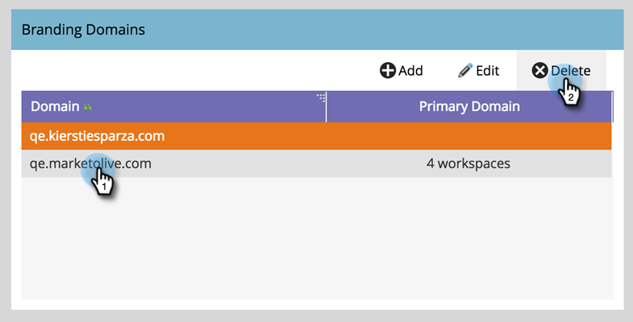

# 删除品牌域名 {#delete-a-branding-domain}

1. 进入 **[!UICONTROL Admin]** 区域。

   

1. 单击 **[!UICONTROL Email]**。

   

1. 在“品牌策略域”表中，选择要删除的域，然后单击&#x200B;**[!UICONTROL Delete]**。

   

   >[!NOTE]
   >
   >如果要删除主品牌域，必须首先选择其他品牌域作为主品牌域。
