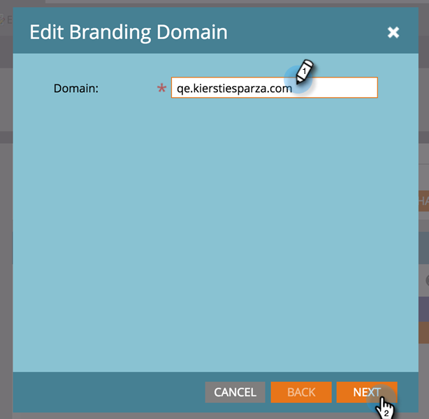
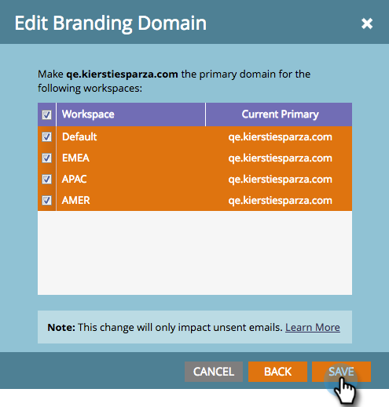

# 使用工作区编辑默认品牌化域 {#edit-your-default-branding-domain-with-workspaces}

1. 进入 **[!UICONTROL Admin]** 区域。

   

1. 单击 **[!UICONTROL Email]**。

   

1. 在[!UICONTROL Branding Domains]表中，选择当前的通用域，然后单击&#x200B;**[!UICONTROL Edit]**&#x200B;以将其更改为贵公司的品牌域。

   

   >[!NOTE]
   >
   >在您编辑通用域之前，**[!UICONTROL Add]**&#x200B;不起作用。 在添加第二个域之前，**[!UICONTROL Delete]**&#x200B;不起作用。

1. 输入默认域的名称，然后单击&#x200B;**[!UICONTROL Next]**。

   

1. 单击 **[!UICONTROL Save]**。

   

>[!NOTE]
>
>添加其他品牌域时，您可以选择将此域设置为一个或多个工作区的主域，并且所有设置为“默认”的现有未发送电子邮件和所有新创建的电子邮件都将默认为主域。 您可以逐封电子邮件覆盖此项。

现在，您可以[添加工作区所需的其他品牌推广域](/help/marketo/product-docs/administration/email-setup/add-multiple-branding-domains/add-an-additional-branding-domain-with-workspaces.md)。
