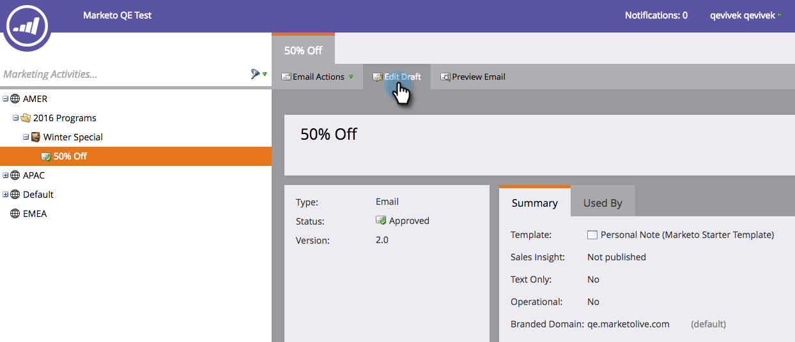

# 覆盖电子邮件{#overwrite-primary-domain-for-emails}的主域

您可以根据电子邮件覆盖主品牌域。 这将更改发送电子邮件时链接的品牌化方式。

1. 转至&#x200B;**营销活动**。

   

1. 选择一封电子邮件，然后单击&#x200B;**编辑草稿**。

   

1. 选择要使用的品牌域。

   

   >[!NOTE]
   >
   >并非所有用户都具有按电子邮件设置品牌域的权限。 如果您未看到“品牌域”下拉列表，请与您的管理员联系。
