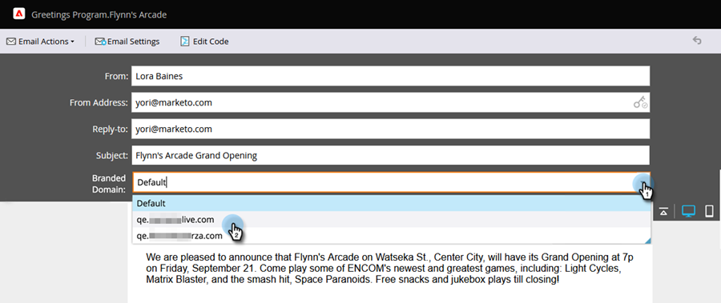

# 覆盖电子邮件的主域 {#overwrite-primary-domain-for-emails}

您可以根据电子邮件覆盖主品牌域。 这将更改发送电子邮件时链接的品牌化方式。

1. 转到 **营销活动**.

   

1. 选择电子邮件并单击 **编辑草稿**.

   

1. 选择要使用的品牌策略域。

   

   >[!NOTE]
   >
   >并非所有用户都有权按电子邮件设置品牌域。 如果看不到“品牌域”下拉列表，请与您的管理员联系。
