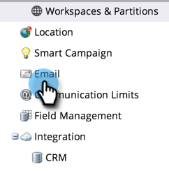

# 编辑取消订阅消息 {#edit-the-unsubscribe-message}

>[!NOTE]
>
>**需要管理员权限**

当您发送营销电子邮件时(非[可操作](/help/marketo/product-docs/email-marketing/general/functions-in-the-editor/make-an-email-operational.md))，取消订阅文本和链接将附加到底部。 您可以更改默认值。 具体方法如下。

## 进行编辑的位置 {#where-to-make-the-edit}

1. 转到 **[!UICONTROL 管理员]** 部分。

   

1. 单击 **[!UICONTROL 电子邮件]**.

   

   >[!CAUTION]
   >
   >以下变量至关重要。 不要删除它们！
   >
   >* `%mkt_opt_out_prefix%`
   >* `mkt_unsubscribe=1&mkt_tok=##MKT_TOK##`

1. 编辑 **[!UICONTROL 取消订阅HTML]** 和 **[!UICONTROL 取消订阅文本]** 您喜欢的版本，然后单击 **[!UICONTROL 保存更改]**.

   

   给你。 _务必进行测试！_ 您不希望营销电子邮件具有中断的取消订阅链接。

>[!TIP]
>
>您可以使用自定义取消订阅HTML在电子邮件中的位置 [令牌](/help/marketo/product-docs/email-marketing/general/using-tokens/add-a-system-token-as-a-link-in-an-email.md).

## 默认取消订阅文本 {#default-unsubscribe-text}

如果您需要恢复为默认系统取消订阅，请复制/粘贴以下内容：

[!UICONTROL 取消订阅HTML]：
`<pre data-theme="Confluence">
If you no longer wish to receive these emails, click on the following link: <a href="%mkt_opt_out_prefix%UnsubscribePage.html?mkt_unsubscribe=1&mkt_tok=##MKT_TOK##">Unsubscribe</a> 
</pre>` [!UICONTROL 取消订阅文本]：
`<pre data-theme="Confluence">%mkt_opt_out_prefix%UnsubscribePage.html?mkt_unsubscribe=1&mkt_tok=##MKT_TOK##</pre>`

>[!MORELIKETHIS]
>
>[编辑“以网页形式查看”消息](/help/marketo/product-docs/administration/email-setup/edit-the-view-as-web-page-message.md)
