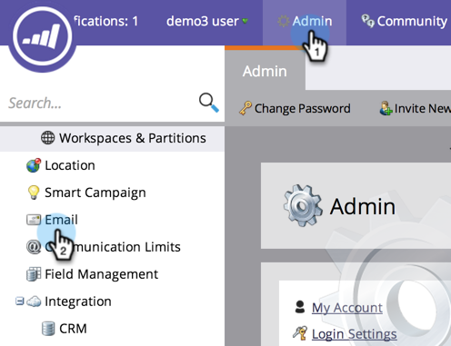

# 编辑取消订阅消息{#edit-the-unsubscribe-message}

>[!NOTE]
>
>**需要管理权限**

当您发送营销电子邮件（非[operational](/help/marketo/product-docs/email-marketing/general/functions-in-the-editor/make-an-email-operational.md)）时，取消订阅文本和链接会附加到底部。 您可以更改默认值。 下面介绍如何操作。

## 编辑取消订阅消息{#edit-the-unsubscribe-message-1}

1. 在&#x200B;**Admin**&#x200B;下，单击&#x200B;**电子邮件**。

   

   >[!CAUTION]
   >
   >以下变量至关重要。 不要删除它们！
   >
   >* **%mkt_opt_out_prefix%**
   >* **mkt_unsubscribe=1&amp;mkt_tok=##MKT_TOK#**

1. 编辑&#x200B;**取消订阅HTML**&#x200B;和&#x200B;**取消订阅文本**&#x200B;版本，然后单击&#x200B;**保存更改**。

   

   给你。 _一定要测试！_ 您不希望营销电子邮件中断取消订阅链接。

>[!TIP]
>
>您可以使用[令牌](/help/marketo/product-docs/email-marketing/general/using-tokens/add-a-system-token-as-a-link-in-an-email.md)自定义取消订阅HTML在电子邮件中的位置。

## 默认取消订阅文本{#default-unsubscribe-text}

如果您曾经需要还原到默认系统取消订阅，请复制/粘贴以下内容：

取消订阅HTML:
`<pre data-theme="Confluence">
If you no longer wish to receive these emails, click on the following link: <a href="%mkt_opt_out_prefix%UnsubscribePage.html?mkt_unsubscribe=1&mkt_tok=##MKT_TOK##">Unsubscribe</a> 
</pre>`取消订阅文本：
`<pre data-theme="Confluence">%mkt_opt_out_prefix%UnsubscribePage.html?mkt_unsubscribe=1&mkt_tok=##MKT_TOK##</pre>`

>[!MORELIKETHIS]
>
>[编辑“视图为网页”消息](/help/marketo/product-docs/administration/email-setup/edit-the-view-as-web-page-message.md)
