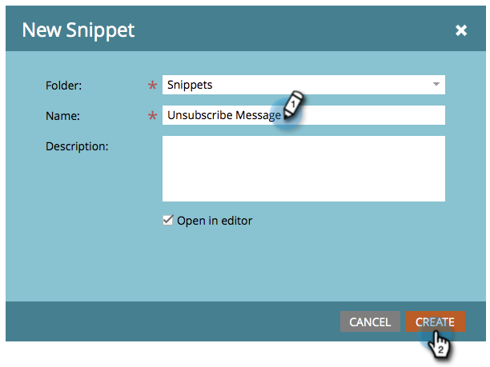
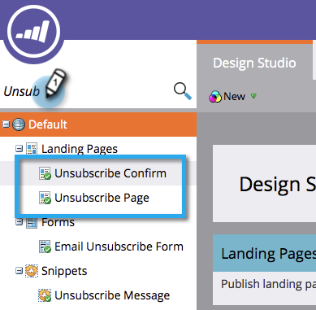

# 使您的取消订阅消息对语言{#make-your-unsubscribe-message-dynamic-for-languages}保持动态

默认的取消订阅消息和链接为英语。 您可以使用动态内容以不同语言显示它。

>[!NOTE]
>
>下面我们为您设置了这个不错的教程。 它代表了最佳做法，但可以通过其他方式实现。

## 准备数据{#prepare-your-data}

1. [创建名为“](/help/marketo/product-docs/administration/field-management/create-a-custom-field-in-marketo.md) 首选语言”的自定义字段。（如果希望此字段同步，请在CRM中设置它）。

   >[!TIP]
   >
   >将来，当您[创建表单](/help/marketo/product-docs/demand-generation/forms/creating-a-form/create-a-form.md)以捕获语言首选项时，请使用此字段。

## 创建分段{#create-segmentation}

1. 转到&#x200B;**Database**。

   

1. 在&#x200B;**新建**&#x200B;下拉列表中，单击&#x200B;**新建分段**。

   

1. 将分段命名为&#x200B;**首选语言**。 单击&#x200B;**添加区段**。 键入语言。

   

   >[!NOTE]
   >
   >默认区段为英语。

1. 继续添加区段，直到您的所有语言都显示出来。 单击&#x200B;**创建**。

   

1. 选择区段。

   

1. 转到&#x200B;**智能列表**&#x200B;选项卡。 在搜索字段中输入&#x200B;**首选语言**。 将滤镜拖放到画布上。

   

1. 设置相应的语言。

   

1. 为所有不同语言重复上述步骤。 然后，选择&#x200B;**分段操作**&#x200B;下拉框并单击&#x200B;**批准**。

   

## 创建代码片断{#create-a-snippet}

1. 转到&#x200B;**Design Studio**。

   

1. 在&#x200B;**新建**&#x200B;下拉列表中，单击&#x200B;**新建代码片断**。

   

1. 将代码片段命名为&#x200B;**取消订阅消息**。 单击&#x200B;**创建**。

   

1. 键入默认的取消订阅消息，将其选中，然后单击超链接图标。

   

1. 复制并粘贴此令牌：`{{system.unsubscribeLink}}`进入&#x200B;**链接URL**&#x200B;字段。 单击&#x200B;**插入**。

   

1. 在“分段”部分中选择&#x200B;**区段依据**。

   

1. 在“分段”下拉框中，键入&#x200B;**首选**&#x200B;并选择&#x200B;**首选语言**。 单击&#x200B;**保存**。

   

1. 从树中选择区段。 以该语言键入您的取消订阅消息。

   

1. 复制并粘贴相同的标记：`{{system.unsubscribeLink}}`进入&#x200B;**链接URL**&#x200B;字段。 单击&#x200B;**插入**。

   

1. 对所有区段重复上述步骤。 然后，返回Design Studio，单击&#x200B;**代码片断操作**&#x200B;下拉框，然后单击&#x200B;**批准**。

   

   太棒了。 快到了。

## 在电子邮件{#use-snippet-in-an-email}中使用代码片断

1. 在电子邮件编辑器中，单击可编辑的元素。 然后单击齿轮图标并选择&#x200B;**替换为代码片断**。 如果要选择可编辑的片段元素，请单击齿轮图标，然后选择&#x200B;**编辑**。

   

1. 从下拉列表中查找并选择您的代码片断，然后单击&#x200B;**保存**。

   

1. 要测试，请单击&#x200B;**返回**...

   

1. ...然后，选择&#x200B;**Dynamic**&#x200B;选项卡。

   

1. 单击不同语言可查看代码片段的更改。

   

   >[!TIP]
   >
   >当然，您还可以编辑电子邮件的其余部分，使用动态语言。 在进行取消订阅时，请在取消订阅页面上使用相同的方法。

## 使用动态内容{#customizing-your-unsubscribe-page-with-dynamic-content}自定义取消订阅页面

如果您希望您的人员使用其首选语言进入取消订阅页面，则可以在登陆页和确认页面上使用动态内容。

1. 导航到Design Studio。

   

1. 在搜索字段中键入&#x200B;_取消订阅_。 您应找到您的取消订阅页面。

   

1. 单击&#x200B;**编辑草稿**。

   

1. 选择&#x200B;**区段依据**。

   

1. 查找首选语言部分。 单击&#x200B;**保存**。

   

   编辑每个登陆页的内容，批准，一切就绪！

   >[!NOTE]
   >
   >进一步了解[动态内容](/help/marketo/product-docs/personalization/segmentation-and-snippets/segmentation/understanding-dynamic-content.md)和您可以做的所有最酷的事情。
