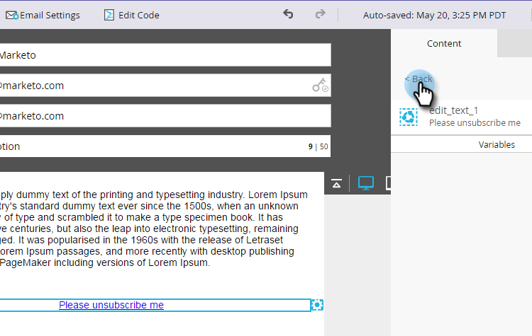

# 使退订消息动态地显示各种语言 {#make-your-unsubscribe-message-dynamic-for-languages}

默认的取消订阅消息和链接为英语。 您可以使用动态内容以不同语言显示内容。

>[!NOTE]
>
>本文是最佳实践，但可以通过其他方式实现。

## 准备数据 {#prepare-your-data}

1. [创建自定义字段](/help/marketo/product-docs/administration/field-management/create-a-custom-field-in-marketo.md) 命名为“首选语言”。 （如果希望同步此字段，请在CRM中设置此字段）。

   >[!TIP]
   >
   >将来，当您 [创建表单](/help/marketo/product-docs/demand-generation/forms/creating-a-form/create-a-form.md) 来捕获语言首选项。

## 创建分段 {#create-segmentation}

1. 转到 **数据库**.

   

1. 在 **新建** 下拉菜单，单击 **新区段**.

   

1. 命名分段 **首选语言**. 单击 **添加区段**. 键入语言。

   

   >[!NOTE]
   >
   >默认区段将为英语。

1. 继续添加区段，直到显示所有语言为止。 单击 **创建**.

   

1. 选择区段。

   

1. 转到 **智能列表** 选项卡。 输入 **首选语言** 中。 将过滤器拖放到画布上。

   

1. 设置相应的语言。

   

1. 请重复执行所有不同的语言。 然后，选择 **分段操作** 下拉菜单并单击 **批准**.

   

## 创建代码片段 {#create-a-snippet}

1. 转到 **Design Studio**.

   

1. 在 **新建** 下拉菜单，单击 **新代码片段**.

   

1. 命名代码片段 **取消订阅消息**. 单击 **创建**.

   

1. 键入默认的取消订阅消息，将其选中，然后单击超链接图标。

   

1. 复制并粘贴此令牌： `{{system.unsubscribeLink}}` 到 **URL** 字段。 单击 **插入**.

   

1. 选择 **区段划分依据** 中的“分段”部分。

   

1. 从“分段”下拉菜单中，键入 **首选** 选择 **首选语言**. 单击 **保存**.

   

1. 从树中选择一个区段。 单击取消订阅，然后单击链接图标。

   

1. 确保 `{{system.unsubscribeLink}}` 仍在URL字段中。 编辑显示文本以匹配您选择的语言。 单击 **应用**.

   

1. 对所有区段重复执行上述步骤。 然后，返回至Design Studio，单击 **代码片段操作** 下拉菜单，然后单击 **批准**.

   

太棒了。 快到了！

## 在电子邮件中使用代码片段 {#use-snippet-in-an-email}

1. 在电子邮件编辑器中，单击可编辑的元素。 然后，单击齿轮图标并选择 **替换为代码片段**. 如果您选择的是可编辑的代码片段元素，请单击齿轮图标，然后选择 **编辑**.

   

1. 从下拉菜单中查找并选择您的代码片段，然后单击 **保存**.

   

1. 要测试它，请单击 **返回**...

   

1. ...然后 **动态** 选项卡。

   

1. 单击不同的语言可查看代码片段的更改。

   

   >[!TIP]
   >
   >当然，您也可以编辑电子邮件中的其他动态语言内容。 在执行此操作时，请在取消订阅页面上使用相同的技术。

## 使用动态内容自定义取消订阅页面 {#customizing-your-unsubscribe-page-with-dynamic-content}

如果您希望用户以其首选语言进入取消订阅页面，则可以在登陆页面和确认页面上使用动态内容。

1. 导航到 **Design Studio**.

   

1. 键入 _取消订阅_ 在搜索字段中，选择所需的取消订阅页面。

   

1. 单击 **编辑草稿**.

   

1. 选择 **区段划分依据**.

   

1. 查找首选语言区段。 单击 **保存**.

   

   编辑每个登陆页面的内容、进行批准，您无需重新访问！

   >[!NOTE]
   >
   >详细了解 [动态内容](/help/marketo/product-docs/personalization/segmentation-and-snippets/segmentation/understanding-dynamic-content.md) 还有你能做的所有很酷的事。
