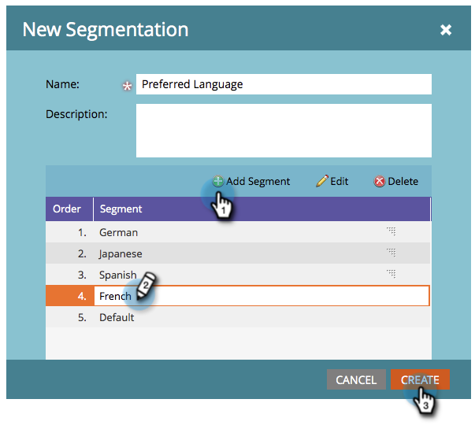

# 为不同语言动态设置取消订阅消息 {#make-your-unsubscribe-message-dynamic-for-languages}

默认取消订阅消息和链接为英文。 您可以使用动态内容以不同的语言显示内容。

>[!NOTE]
>
>本文代表了一种最佳实践，但可以通过其他方式实现。

## 准备数据 {#prepare-your-data}

1. [创建名为“首选语言”的自定义字段](/help/marketo/product-docs/administration/field-management/create-a-custom-field-in-marketo.md)。 （如果您希望同步此字段，请在CRM中设置它）。

   >[!TIP]
   >
   >将来，当您[创建表单](/help/marketo/product-docs/demand-generation/forms/creating-a-form/create-a-form.md)以捕获语言首选项时，使用此字段。

## 创建分段 {#create-segmentation}

1. 转到&#x200B;**[!UICONTROL Database]**。

   

1. 在&#x200B;**[!UICONTROL New]**&#x200B;下拉列表中，单击&#x200B;**[!UICONTROL New Segmentation]**。

   

1. 命名分段&#x200B;**[!UICONTROL Preferred Language]**。 单击&#x200B;**[!UICONTROL Add Segment]**。 键入语言。

   

   >[!NOTE]
   >
   >默认区段将为英语。

1. 继续添加区段，直到所有语言均得到表示。 单击 **[!UICONTROL Create]**。

   

1. 选择区段。

   

1. 转到&#x200B;**[!UICONTROL Smart List]**&#x200B;选项卡。 在搜索字段中输入&#x200B;**[!UICONTROL Preferred Language]**。 将过滤器拖放到画布上。

   

1. 设置相应的语言。

   

1. 对所有不同的语言重复此操作。 然后，选择&#x200B;**[!UICONTROL Segmentation Actions]**&#x200B;下拉列表并单击&#x200B;**[!UICONTROL Approve]**。

   

## 创建代码段 {#create-a-snippet}

1. 转到&#x200B;**[!UICONTROL Design Studio]**。

   

1. 在&#x200B;**[!UICONTROL New]**&#x200B;下拉列表中，单击&#x200B;**[!UICONTROL New Snippet]**。

   

1. 将代码片段命名为&#x200B;**取消订阅消息**。 单击 **[!UICONTROL Create]**。

   

1. 键入默认取消订阅消息，将其突出显示，然后单击超链接图标。

   

1. 将此令牌： `{{system.unsubscribeLink}}`复制并粘贴到&#x200B;**[!UICONTROL URL]**&#x200B;字段中。 单击 **[!UICONTROL Insert]**。

   

1. 在&#x200B;**[!UICONTROL Segment By]**&#x200B;部分中选择&#x200B;**[!UICONTROL Segmentation]**。

   

1. 从&#x200B;**[!UICONTROL Segmentation]**&#x200B;下拉列表中，键入&#x200B;**[!UICONTROL Preferred]**&#x200B;并选择&#x200B;**[!UICONTROL Preferred Language]**。 单击 **[!UICONTROL Save]**。

   

1. 从树中选择一个段。 单击取消订阅，然后单击链接图标。

   

1. 确保`{{system.unsubscribeLink}}`仍然在&#x200B;**[!UICONTROL URL]**&#x200B;字段中。 编辑&#x200B;**[!UICONTROL Display Text]**&#x200B;以匹配您选择的语言。 单击 **[!UICONTROL Apply]**。

   

1. 对所有区段重复执行上述操作。 然后，返回&#x200B;**[!UICONTROL Design Studio]**，单击&#x200B;**[!UICONTROL Snippet Actions]**&#x200B;下拉列表，然后单击&#x200B;**[!UICONTROL Approve]**。

   

太棒了。 快到了！

## 在电子邮件中使用代码片段 {#use-snippet-in-an-email}

1. 在电子邮件编辑器中，单击可编辑的元素。 然后单击齿轮图标并选择&#x200B;**[!UICONTROL Replace with Snippet]**。 如果要选择可编辑的代码片段元素，请单击齿轮图标并选择&#x200B;**[!UICONTROL Edit]**。

   

1. 从下拉列表中查找并选择您的代码片段，然后单击&#x200B;**[!UICONTROL Save]**。

   

1. 要测试它，请单击&#x200B;**[!UICONTROL Back]**...

   

1. ...然后&#x200B;**[!UICONTROL Dynamic]**&#x200B;选项卡。

   

1. 单击不同的语言以查看代码片断更改。

   

   >[!TIP]
   >
   >当然，您也可以针对动态语言编辑电子邮件的其余部分。 在执行此操作时，在取消订阅页面上执行相同的技术。

## 使用动态内容自定义取消订阅页面 {#customizing-your-unsubscribe-page-with-dynamic-content}

如果您希望您的用户使用首选语言访问取消订阅页面，则可以在登陆页面和确认页面上使用动态内容。

1. 导航到&#x200B;**[!UICONTROL Design Studio]**。

   

1. 在搜索字段中键入&#x200B;_取消订阅_，然后选择所需的“取消订阅”页面。

   

1. 单击 **[!UICONTROL Edit Draft]**。

   

1. 选择 **[!UICONTROL Segment By]**。

   

1. 查找&#x200B;**[!UICONTROL Preferred Language]**&#x200B;区段。 单击 **[!UICONTROL Save]**。

   

   编辑每个登陆页面的内容并进行审批，您就可以开始了！

   >[!NOTE]
   >
   >了解有关[动态内容](/help/marketo/product-docs/personalization/segmentation-and-snippets/segmentation/understanding-dynamic-content.md)以及您可以执行的所有精彩内容的更多信息。
