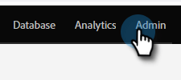

# 营销活动级别的电子邮件打开跟踪 {#email-open-tracking-at-campaign-level}

此功能允许您控制跟踪电子邮件打开次数，可以是针对营销活动中的每次打开控制一次，也可以只针对每封电子邮件控制一次，而不管它在不同营销活动中使用了多少次。

>[!NOTE]
>
>**需要管理员权限**

1. 转到&#x200B;**管理员**&#x200B;区域。

   

1. 单击&#x200B;**智能营销活动**。

   

1. 在&#x200B;_电子邮件打开次数设置_&#x200B;旁边，单击&#x200B;**编辑**。

   

1. 单击下拉列表，选择所需的设置，然后单击&#x200B;**保存**。

   

<table><tbody>
  <tr>
    <td><b>已启用</b></td>
    <td>每个营销活动的电子邮件打开次数将单独进行跟踪。</td>
  </tr>
  <tr>
    <td><b>已禁用</b></td>
    <td>将跟踪电子邮件打开次数……</td>
  </tr>
</tbody>
</table>
