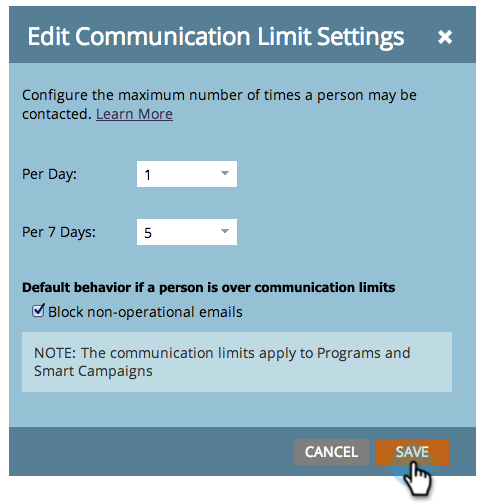

# 启用通信限制 {#enable-communication-limits}

不要与你的员工过度交流，这非常重要。 设置通信限制将有助于防止您的组织发送过多电子邮件。

>[!NOTE]
>
>**需要管理员权限**

1. 转到 **[!UICONTROL 管理员]** 区域。

   

1. 单击 **[!UICONTROL 通信限制]**.

   

1. 单击 **[!UICONTROL 编辑]**.

   

   >[!NOTE]
   >
   >[!UICONTROL 每天] 基于订阅时区的日历日（午夜 — 午夜）。

1. 单击 **[!UICONTROL 每天]** 下拉列表并选择所需的限制。 在此示例中，我们选择1。

   

   >[!TIP]
   >
   >您还可以选择 **[!UICONTROL 自定义]** 如果预设选项均不适用，则为。

1. 单击 **[!UICONTROL 每7天]** 下拉列表并选择所需的限制。 在本例中，我们选择5。

   

1. 选择 **[!UICONTROL 阻止非运营电子邮件]**.

   

   >[!NOTE]
   >
   >详细了解内容 [操作电子邮件](/help/marketo/product-docs/email-marketing/general/functions-in-the-editor/make-an-email-operational.md) 是。

1. 单击 **[!UICONTROL 保存]**.

   

   >[!NOTE]
   >
   >**示例**
   >
   >上述设置意味着用户不会收到超过 **每天1封电子邮件** 或大于 **任何七天期间为5**.

   >[!NOTE]
   >
   >通信限制自动应用于所有电子邮件和参与计划。

>[!MORELIKETHIS]
>
>[将通信限制应用于Smart Campaign](/help/marketo/product-docs/core-marketo-concepts/smart-campaigns/using-smart-campaigns/apply-communication-limits-to-smart-campaign.md)
