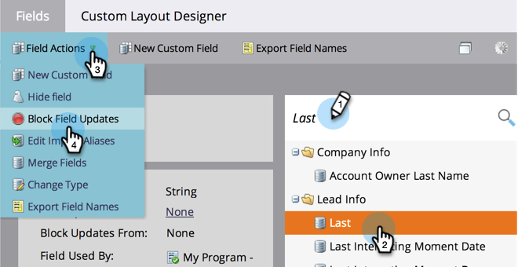

# 在从不受信任来源导入列表时阻止字段更新 {#block-field-updates-during-list-import-from-untrusted-sources}

与其他列表相比，您可以更加信任某些列表中的数据。 有时，如果字段为空，则您具有可疑数据并想要接受数据，但如果没有现有值，则不接受。 您可以通过阻止关键字段上的字段更新来完成此操作。

>[!NOTE]
>
>**需要管理员权限**

## 阻止来自不受信任来源的字段更新 {#blocking-field-updates-from-untrusted-sources}

1. 进入 **[!UICONTROL Admin]** 区域。

   

1. 单击 **[!UICONTROL Field Management]**。

   

1. 找到所需的字段，选择它，然后在&#x200B;**[!UICONTROL Field Actions]**&#x200B;下单击&#x200B;**[!UICONTROL Block Field Updates]**。

   

1. 检查&#x200B;**[!UICONTROL List Import untrusted source]**&#x200B;并单击&#x200B;**[!UICONTROL Apply]**。

   

>[!TIP]
>
>通过同时检查&#x200B;**[!UICONTROL List Import trusted source]**，您可以保护所有列表中的字段的安全，无论这些字段受信任还是不受信任。

对要防止非受信任列表出现的任何其他字段重复上述步骤。

## 运行不受信任的列表导入 {#running-an-untrusted-list-import}

1. 运行列表导入时，如果希望上一步中设置的所有字段都安全，请确保选择&#x200B;**[!UICONTROL Untrusted]**。

   

有关导入列表的详细说明，请参阅[导入人员列表](/help/marketo/getting-started/quick-wins/import-a-list-of-people.md)。

现在，密钥字段可免受不受信任的列表导入的攻击。
