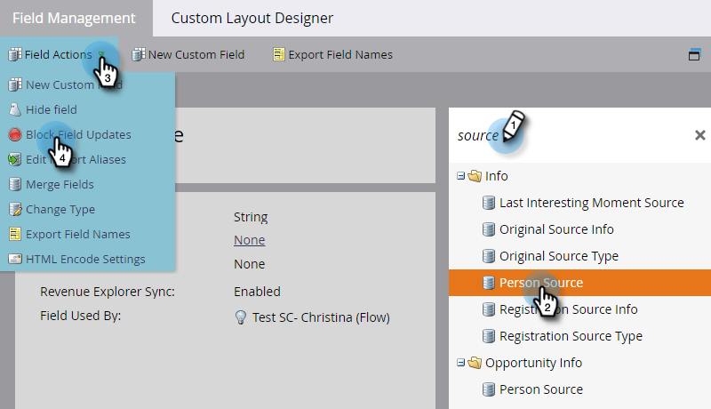
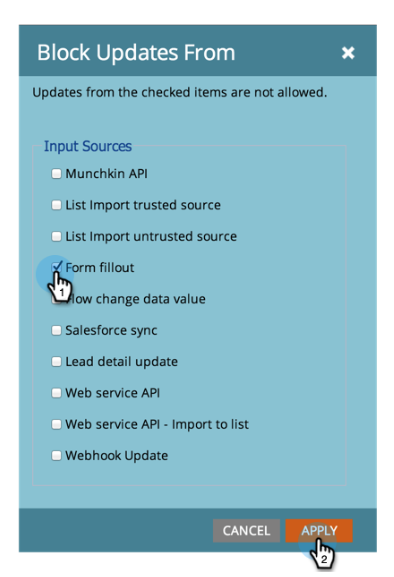

# 阻止字段更新 {#block-updates-to-a-field}

阻止字段更新允许您写入字段一次，然后保留记录生命周期的原始值。 这对于诸如[!UICONTROL Person Source]之类的字段可能很有用。

>[!NOTE]
>
>**需要管理员权限**

1. 进入 **[!UICONTROL Admin]** 区域。

   

1. 单击 **[!UICONTROL Field Management]**。

   

1. 找到该字段并选择它，然后在&#x200B;**[!UICONTROL Field Actions]**&#x200B;下单击&#x200B;**[!UICONTROL Block Field Updates]**。

   

   >[!NOTE]
   >
   >您也可以阻止对[项目成员自定义字段](/help/marketo/product-docs/core-marketo-concepts/programs/working-with-programs/program-member-custom-fields.md)的更新。

1. 选择要阻止的&#x200B;**[!UICONTROL Input Sources]**&#x200B;并单击&#x200B;**[!UICONTROL Apply]**。

   

   >[!CAUTION]
   >
   >执行列表导入时，仅当字段的名称与&#x200B;_完全_&#x200B;匹配时（或如果已建立别名），Marketo自动识别该字段时，导入预览中阻止的字段的状态才会显示。 如果从Marketo字段下拉列表中手动选择字段，则导入预览中将不会显示阻止的状态，但仍会对该字段实施更新阻止。
